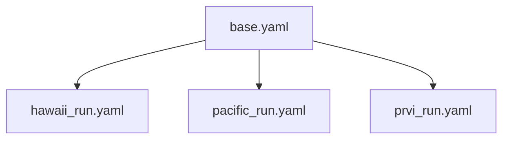
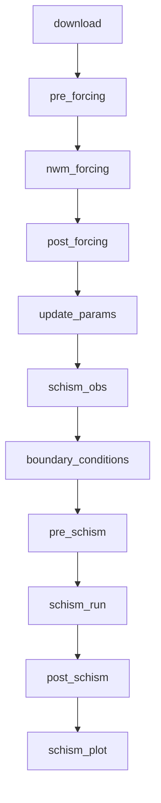
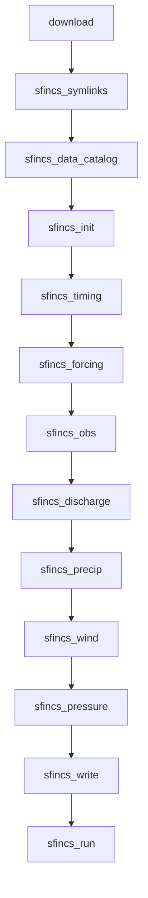
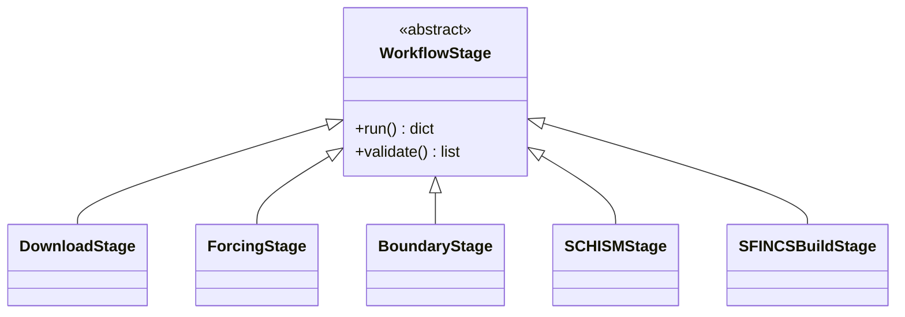

# coastal-calibration: Design Documentation

!!! warning "Historical document"

    This records the original design rationale for replacing the bash-based SCHISM
    calibration workflow with a Python package, as of March 2026. It is **not** a current
    architecture reference: the package layout, the workflow stage names and the deployment
    model have all moved on since it was written, and the sections describing them have been
    removed rather than left to mislead.

    For how the system works today, see [Concepts and Workflows](docs/concepts/index.md),
    [Workflow Stages](docs/user-guide/workflow-stages.md) and the
    [API Reference](docs/reference/api.md). For what is planned, see the Roadmap on the
    project home page.

    What is kept here is the part that does not go stale: what the original bash workflow
    looked like, why it was replaced, and the design decisions taken at the time.

## Overview

The `coastal-calibration` Python package is a complete redesign and rewrite of the
original bash-based SCHISM model calibration workflow. This document details the
architectural improvements, design decisions, and substantial enhancements made over the
original implementation.

______________________________________________________________________

## Table of Contents

1. [Executive Summary](#executive-summary)
1. [Original Implementation Analysis](#original-implementation-analysis)
1. [New Architecture](#new-architecture)
1. [Key Design Decisions](#key-design-decisions)
1. [Substantial Improvements](#substantial-improvements)
1. [API Reference](#api-reference)

______________________________________________________________________

## Executive Summary

The `coastal-calibration` package provides a modern Python interface for running SCHISM
and SFINCS coastal model calibration workflows on HPC clusters. It wraps the existing
operational workflow scripts with a clean, type-safe API while establishing the
foundation for incremental improvements.

### Design Goals

The primary objectives of this rewrite are to create a workflow that is:

1. **Intuitive and user-friendly** - Simple YAML configuration, clear CLI commands,
    helpful error messages
1. **Less prone to errors** - Type-safe configuration, comprehensive validation,
    structured logging
1. **Extensible** - Polymorphic model architecture that supports SCHISM, SFINCS, and
    future models via a common `ModelConfig` ABC

### Architectural Strategy

The package is designed with a **stable public API** that shields users from internal
changes. This enables:

- **Immediate usability** - Users get a clean interface today, even while internals are
    being improved
- **Incremental rewriting** - Embedded bash scripts can be replaced with pure Python one
    stage at a time
- **Safe evolution** - Internal rewrites don't break user-facing code or configurations

The long-term goal is to **completely rewrite** all embedded bash scripts in Python, but
doing so incrementally allows the package to be useful immediately while that work
proceeds.

### Key Features

- **Type-safe configuration** via `dataclasses` with runtime validation
- **Modular stage-based architecture** for maintainability and extensibility
- **Native Python datetime handling** replacing fragile shell date arithmetic
- **Async data downloading** with built-in source validation
- **CLI and programmatic APIs** for both interactive and automated use
- **Progress tracking** and structured logging
- **Configuration inheritance** for DRY multi-run setups
- **Smart default paths** with variable interpolation

______________________________________________________________________

## Original Implementation Analysis

### File Structure (20+ scripts)

```console
calib_org/
├── sing_run.bash                     # Main entry point (258 lines)
├── schism_calib.cfg                  # Configuration file
├── pre_nwm_forcing_coastal.bash      # Forcing preparation
├── post_nwm_forcing_coastal.bash     # Forcing post-processing
├── make_tpxo_ocean.bash              # TPXO boundary conditions
├── pre_regrid_stofs.bash             # STOFS pre-processing
├── post_regrid_stofs.bash            # STOFS post-processing
├── update_param.bash                 # Parameter file updates (249 lines)
├── pre_schism.bash                   # SCHISM input preparation
├── post_schism.bash                  # SCHISM output processing
├── merge_source_sink.bash            # Discharge file merging
├── initial_discharge.bash            # Initial discharge creation
├── combine_sink_source.bash          # Sink/source combination
└── run_sing_coastal_workflow_*.bash  # 8+ Singularity wrappers
```

### Critical Issues in Original Implementation

#### 1. Fragile Date Arithmetic

The original workflow relied on external scripts for date calculations:

```bash
# Original: External script calls for every date operation
export FORCING_END_DATE=$(${USHnwm}/utils/advance_time.sh $PDY$cyc $LENGTH_HRS)'00'
pdycyc=$(${USHnwm}/utils/advance_time.sh $PDY$cyc $hr)
```

This approach had several problems:

- Required external `advance_time.sh` and `advance_cymdh.pl` scripts
- Shell spawning overhead for each date operation
- Inconsistent handling of edge cases (leap years, month boundaries)
- No error handling for invalid dates

#### 2. Environment Variable Pitfalls

The original scripts passed dozens of environment variables between scripts:

```bash
# Original configuration (schism_calib.cfg)
export STARTPDY=20230611
export STARTCYC=00
export FCST_LENGTH_HRS=3.0
export HOT_START_FILE=''
export USE_TPXO="NO"
export COASTAL_DOMAIN=pacific
export METEO_SOURCE=NWM_RETRO
export COASTAL_WORK_DIR=/efs/schism_use_case/...

# Plus 40+ more in sing_run.bash
export NGWPC_COASTAL_PARM_DIR=/ngen-test/coastal/ngwpc-coastal
export NGEN_APP_DIR=/ngen-app
export FCST_TIMESTEP_LENGTH_SECS=3600
export OTPSDIR=$NGEN_APP_DIR/OTPSnc
# ... etc
```

Problems:

- No validation of variable values
- Easy to have typos that fail silently
- Difficult to track variable dependencies
- No documentation of which variables are required vs optional

#### 3. String-Based Domain Mapping

```bash
# Original: Repeated in multiple files
declare -A coastal_domain_to_inland_domain=( \
    [prvi]="domain_puertorico" \
    [hawaii]="domain_hawaii" \
    [atlgulf]="domain" \
    [pacific]="domain" )

declare -A coastal_domain_to_nwm_domain=( \
    [prvi]="prvi" \
    [hawaii]="hawaii" \
    [atlgulf]="conus" \
    [pacific]="conus" )

declare -A coastal_domain_to_geo_grid=( \
    [prvi]="geo_em_PRVI.nc" \
    [hawaii]="geo_em_HI.nc" \
    [atlgulf]="geo_em_CONUS.nc" \
    [pacific]="geo_em_CONUS.nc" )
```

Problems:

- Duplicated across multiple scripts
- No compile-time type checking
- Silent failures on unknown domains

#### 4. No Data Download Integration

The original workflow required manual data downloading via a separate workflow. That
workflow had no date validation, no source awareness, and no progress tracking.

#### 5. Minimal Error Handling

```bash
# Original: Scripts would continue on failure
singularity exec -B $BINDINGS --pwd ${work_dir} $SIF_PATH \
    ./run_sing_coastal_workflow_pre_forcing_coastal.bash
# No error check here

${MPICOMMAND3} singularity exec -B $BINDINGS \
    --pwd ${work_dir} \
    $SIF_PATH \
    $CONDA_ENVS_PATH/$CONDA_ENV_NAME/bin/python \
    $USHnwm/wrf_hydro_workflow_dev/forcings/WrfHydroFECPP/workflow_driver.py
# No error check here either
```

______________________________________________________________________

## New Architecture

### Core Components

#### 1. Configuration System (`config/schema.py`)

The new configuration system uses Python `dataclasses` with full type hints:

```python
from dataclasses import dataclass
from typing import Literal

CoastalDomain = Literal["prvi", "hawaii", "atlgulf", "pacific"]
MeteoSource = Literal["nwm_retro", "nwm_ana"]
BoundarySource = Literal["tpxo", "stofs"]


@dataclass
class SimulationConfig:
    """Simulation time and domain configuration."""

    start_date: datetime
    duration_hours: int
    coastal_domain: CoastalDomain
    meteo_source: MeteoSource
    timestep_seconds: int = 3600

    # Domain mappings as class variables
    _INLAND_DOMAIN: ClassVar[dict[str, str]] = {
        "prvi": "domain_puertorico",
        "hawaii": "domain_hawaii",
        "atlgulf": "domain",
        "pacific": "domain",
    }

    @property
    def start_pdy(self) -> str:
        """Return start date as YYYYMMDD string."""
        return self.start_date.strftime("%Y%m%d")

    @property
    def inland_domain(self) -> str:
        """Inland domain directory name for this coastal domain."""
        return self._INLAND_DOMAIN[self.coastal_domain]
```

Benefits:

- **Type safety**: IDE autocompletion, static analysis with `pyright`
- **Self-documenting**: Property names and docstrings explain purpose
- **Validation**: Runtime checks with helpful error messages
- **DRY**: Domain mappings defined once

#### 2. YAML Configuration with Inheritance

```yaml
# base.yaml - Shared defaults
paths:
  nfs_mount: /ngen-test

---
# hawaii_run.yaml - Inherits from base
_base: base.yaml

simulation:
  start_date: '2023-06-11T00:00:00'
  duration_hours: 24
  coastal_domain: hawaii
  meteo_source: nwm_retro

paths:
  work_dir: /ngen-test/coastal_runs/${simulation.coastal_domain}
```

Features:

- **Variable interpolation**: `${section.key}` syntax
- **Inheritance**: `_base` field for configuration reuse
- **Deep merging**: Override only what changes
- **Smart defaults**: Minimal configuration required

When paths are not specified, they are automatically generated using templates that
include the `${model}` variable for model-aware directory naming:

```python
DEFAULT_WORK_DIR_TEMPLATE = (
    "/ngen-test/coastal/${user}/"
    "${model}_${simulation.coastal_domain}_${boundary.source}_${simulation.meteo_source}/"
    "${model}_${simulation.start_date}"
)

DEFAULT_RAW_DOWNLOAD_DIR_TEMPLATE = (
    "/ngen-test/coastal/${user}/"
    "${model}_${simulation.coastal_domain}_${boundary.source}_${simulation.meteo_source}/"
    "raw_data"
)
```



#### 3. Stage-Based Workflow Architecture

The stage pipeline is model-specific. Each `ModelConfig` subclass defines its own
`stage_order` and `create_stages()`.

**SCHISM pipeline:**



**SFINCS pipeline:**



Each stage is a Python class inheriting from `WorkflowStage`:



The base class implementation:

```python
class WorkflowStage(ABC):
    """Abstract base class for workflow stages."""

    name: str = "base"
    description: str = "Base workflow stage"

    def __init__(self, config: CoastalCalibConfig, monitor: WorkflowMonitor | None):
        self.config = config
        self.monitor = monitor

    def build_environment(self) -> dict[str, str]:
        """Build environment variables for the stage."""
        # Converts config to env vars for bash scripts
        env = os.environ.copy()
        env["STARTPDY"] = self.config.simulation.start_pdy
        env["STARTCYC"] = self.config.simulation.start_cyc
        # ... all precomputed, no shell date arithmetic needed
        return env

    def run_singularity_command(
        self,
        command: list[str],
        use_mpi: bool = False,
        mpi_tasks: int | None = None,
    ) -> subprocess.CompletedProcess[str]:
        """Run a command inside the Singularity container."""
        # Handles all Singularity setup, bindings, error checking
        pass

    @abstractmethod
    def run(self) -> dict[str, Any]:
        """Execute the stage and return results."""
        pass

    def validate(self) -> list[str]:
        """Validate stage prerequisites. Return list of errors."""
        return []
```

#### 4. Workflow Runner Orchestration

```python
class CoastalCalibRunner:
    """Main workflow runner for coastal model calibration."""

    @property
    def STAGE_ORDER(self) -> list[str]:
        """Stage order is delegated to the model config."""
        return self.config.model_config.stage_order

    def run(
        self,
        start_from: str | None = None,
        stop_after: str | None = None,
        dry_run: bool = False,
    ) -> WorkflowResult:
        """Execute the calibration workflow."""
        # Validation, stage sequencing, error handling, result collection
        pass
```

______________________________________________________________________

## Key Design Decisions

### 1. Python-Native Date Arithmetic

**Decision**: Replace all bash/Perl date scripts with Python `datetime`.

**Rationale**:

- Python's `datetime` and `timedelta` handle all edge cases correctly
- No external dependencies or shell spawning
- Type-safe with IDE support

**Implementation** (`utils/time.py`):

```python
_DATE_RE = re.compile(r"^\d{10}$")


def _parse_date(date_string: str) -> datetime:
    """Parse a YYYYMMDDHH string into a datetime, with strict validation."""
    if not isinstance(date_string, str) or not _DATE_RE.match(date_string):
        raise ValueError(
            f"date_string must be exactly 10 digits in YYYYMMDDHH format, got {date_string!r}"
        )
    return datetime.strptime(date_string, "%Y%m%d%H")


def advance_time(date_string: str, hours: int) -> str:
    """Advance a date string by a specified number of hours.

    Replaces advance_time.sh and advance_cymdh.pl with native Python.
    Handles leap years, month boundaries, DST, etc.
    """
    dt = _parse_date(date_string) + timedelta(hours=hours)
    return dt.strftime("%Y%m%d%H")
```

The module also consolidates `parse_datetime()` (flexible datetime parsing, previously
duplicated in `config.schema` and `downloader`) and `iter_hours()` (hour-range
iteration, previously in `downloader`).

**Impact**: The `build_environment()` method precomputes shared date-derived values,
then delegates model-specific env vars to `model_config.build_environment()`:

```python
# Shared dates computed once in Python, passed to bash scripts
env["FORCING_BEGIN_DATE"] = f"{pdycyc}00"
env["FORCING_END_DATE"] = forcing_end_dt.strftime("%Y%m%d%H00")
env["END_DATETIME"] = forcing_end_dt.strftime("%Y%m%d%H")

# Model-specific env vars (e.g., SCHISM_BEGIN_DATE, OMP_NUM_THREADS)
env = self.config.model_config.build_environment(env, self.config)
```

### 2. Integrated Data Downloading with Validation

**Decision**: Build a comprehensive downloader with source awareness and date range
validation.

**Rationale**:

- Different data sources have different availability windows
- Users shouldn't waste time on downloads that will fail
- Async downloading is faster than sequential

**Implementation** (`downloader.py`):

```python
DATA_SOURCE_DATE_RANGES: dict[str, dict[str, DateRange]] = {
    "nwm_retro": {
        "conus": DateRange(
            start=datetime(1979, 2, 1),
            end=datetime(2023, 1, 31),
            description="NWM Retrospective 3.0 (CONUS)",
        ),
        "hawaii": DateRange(
            start=datetime(1994, 1, 1),
            end=datetime(2013, 12, 31),
            description="NWM Retrospective 3.0 (Hawaii)",
        ),
        # ...
    },
    "stofs": {
        "_default": DateRange(
            start=datetime(2020, 12, 30),
            end=None,  # operational, no end date
            description="STOFS (operational)",
        ),
    },
}


def download_data(
    start_time: datetime,
    end_time: datetime,
    output_dir: Path,
    domain: Domain,
    meteo_source: MeteoSource = "nwm_retro",
    coastal_source: CoastalSource = "stofs",
) -> DownloadResults:
    """Download with validation and progress tracking."""
    # Validates dates before downloading
    errors = _validate_date_ranges(start, end, meteo_source, coastal_source, domain)
    if errors:
        raise ValueError("Date range validation failed:\n" + "\n".join(errors))

    # Uses tiny_retriever for async parallel downloads
    download(urls, paths, timeout=timeout)
```

### 3. Configuration Over Convention

**Decision**: Use explicit YAML configuration with sensible defaults.

**Rationale**:

- Original relied on implicit conventions (file locations, naming patterns)
- Explicit configuration is self-documenting
- Easier to version control and share

**Example SCHISM configuration**:

```yaml
simulation:
  start_date: '2023-06-11T00:00:00'
  duration_hours: 24
  coastal_domain: pacific
  meteo_source: nwm_retro

boundary:
  source: tpxo  # or: source: stofs

paths:
  work_dir: /ngen-test/coastal_runs/my_run
  raw_download_dir: /ngen-test/data/downloads

# SCHISM compute parameters (model_config defaults to SchismModelConfig)
model_config:
  nodes: 2
  ntasks_per_node: 18
  nscribes: 2
  omp_num_threads: 2

download:
  enabled: true
  skip_existing: true
```

**Example SFINCS configuration**:

```yaml
model: sfincs

simulation:
  start_date: 2025-06-01
  duration_hours: 168
  coastal_domain: atlgulf
  meteo_source: nwm_ana

boundary:
  source: stofs

model_config:
  prebuilt_dir: /path/to/texas/model
  include_noaa_gages: true
  forcing_to_mesh_offset_m: 0.0    # STOFS already in mesh datum
  vdatum_mesh_to_msl_m: 0.171      # mesh datum → MSL for obs comparison
  omp_num_threads: 36

download:
  enabled: true
  skip_existing: true
```

### 4. Direct Execution Inside SLURM Jobs (`run` Command)

**Decision**: Provide a `run` command for direct, in-process execution inside
user-written `sbatch` scripts.

**Rationale**:

Users need full control over SLURM resource allocation, for example when using
non-default partitions, requesting specific hardware, or embedding the workflow in a
larger pipeline. The `run` command executes all stages locally on whatever resources are
already allocated, making it ideal for use inside manually written `sbatch` scripts.

**Usage pattern (preferred on clusters)**:

The recommended approach on clusters is to write an `sbatch` script that creates a YAML
configuration inline using a heredoc and passes it to `coastal-calibration run`. This is
the preferred method because:

- The SLURM directives in the `sbatch` script control resource allocation, while the
    YAML controls workflow configuration
- Everything is contained in a single file that can be submitted with `sbatch`
- No separate YAML file needs to be managed or kept in sync with SLURM settings
- The heredoc is self-documenting: reviewers can see the exact configuration used

```bash
#!/usr/bin/env bash
#SBATCH --job-name=coastal_schism
#SBATCH --partition=c5n-18xlarge
#SBATCH -N 2
#SBATCH --ntasks-per-node=18
#SBATCH --exclusive
#SBATCH --output=slurm-%j.out

CONFIG_FILE="/tmp/coastal_config_${SLURM_JOB_ID}.yaml"

cat > "${CONFIG_FILE}" <<'EOF'
model: schism

simulation:
  start_date: 2021-01-01
  duration_hours: 12
  coastal_domain: hawaii
  meteo_source: nwm_retro

boundary:
  source: tpxo

model_config:
  include_noaa_gages: true
EOF

/ngen-test/coastal-calibration/coastal-calibration run "${CONFIG_FILE}"
rm -f "${CONFIG_FILE}"
```

**Design choices**:

- The config filename includes `$SLURM_JOB_ID` to avoid collisions when multiple jobs
    run concurrently
- Single-quoted heredoc (`<<'EOF'`) prevents accidental shell variable expansion inside
    the YAML
- Complete examples for both SCHISM and SFINCS are provided in `docs/examples/`

### 5. Stable Public API with Incremental Internal Rewrite

**Decision**: Establish a clean, stable public API while embedding existing scripts as a
transitional measure.

**Rationale**:

The primary goal of this rewrite is to create an **intuitive, user-friendly, and
extensible** workflow system. The existing bash and Python scripts are difficult to
maintain and not performant. However, rewriting everything at once would:

- Delay delivery of a usable tool to users
- Risk introducing regressions without a baseline
- Require extensive testing before any release

**Strategy**:

The architecture deliberately separates **public API** from **private implementation**:

| Layer                      | Components                                                   | Stability |
| -------------------------- | ------------------------------------------------------------ | --------- |
| **Public API**             | `CoastalCalibConfig`, `CoastalCalibRunner`, CLI              | Stable    |
| **Stage Interface**        | `WorkflowStage.run()`, `.validate()`, `.build_environment()` | Stable    |
| **Private Implementation** | Bash scripts → Pure Python                                   | Evolving  |

This allows:

1. **Users get a stable interface today** - The CLI and Python API won't change as
    internals evolve
1. **Incremental rewriting** - Each stage can be rewritten independently without
    affecting others
1. **Testing baseline first** - Establish test coverage against current behavior before
    changes
1. **Performance optimization** - Replace bash subprocess calls with native Python as
    needed

**Current State**:

- Package includes `scripts/` directory with embedded bash scripts
- `WorkflowStage.run_singularity_command()` provides abstraction layer
- Python precomputes all environment variables, minimizing bash complexity

**Future Direction**:

1. Add comprehensive integration tests capturing current behavior
1. Incrementally rewrite stages in pure Python (starting with simpler stages)
1. Deprecate bash scripts as Python replacements are validated
1. Optimize performance-critical paths (file I/O, data processing)

### 6. Strict Type Checking with `pyright`

**Decision**: Use strict `pyright` mode for static type analysis.

**Rationale**:

- Catches errors before runtime
- Enables IDE features (autocomplete, refactoring)
- Self-documents function signatures

**Configuration** (`pyproject.toml`):

```toml
[tool.pyright]
typeCheckingMode = "strict"
include = ["src/coastal_calibration"]
```

______________________________________________________________________

## Substantial Improvements

### 1. Error Handling and Validation

| Aspect                   | Original        | New                                            |
| ------------------------ | --------------- | ---------------------------------------------- |
| Configuration validation | None            | 12+ checks in `CoastalCalibConfig.validate()`  |
| Stage validation         | None            | Each stage has `validate()` method             |
| Error messages           | Exit codes only | Detailed, actionable messages                  |
| Recovery                 | Manual restart  | Partial workflow execution with `--start-from` |

**Validation examples**:

```python
def validate(self) -> list[str]:
    errors = []

    # Shared validation
    if self.simulation.duration_hours <= 0:
        errors.append("simulation.duration_hours must be positive")

    if (
        self.boundary.source == "stofs"
        and not self.boundary.stofs_file
        and not self.download.enabled
    ):
        errors.append(
            "boundary.stofs_file required when using STOFS source and download is disabled"
        )

    # Model-specific validation (delegated to ModelConfig subclass)
    errors.extend(self.model_config.validate(self))

    return errors
```

### 2. Progress Tracking and Monitoring

**Original**: No progress tracking, just log messages scattered in bash scripts.

**New**: Structured monitoring with stage context:

```python
class WorkflowMonitor:
    """Monitors and logs workflow execution progress."""

    def register_stages(self, stages: list[str]) -> None:
        """Register stages for progress tracking."""

    @contextmanager
    def stage_context(self, stage_name: str, description: str):
        """Context manager for stage execution with timing."""
        self.info(f"Starting stage: {stage_name} - {description}")
        start = time.perf_counter()
        try:
            yield
            duration = time.perf_counter() - start
            self.info(f"Completed stage: {stage_name} in {duration:.1f}s")
            self.progress[stage_name] = "completed"
        except Exception as e:
            self.progress[stage_name] = "failed"
            raise

    def save_progress(self, path: Path) -> None:
        """Save progress to JSON for resumption."""
```

### 3. CLI with Multiple Entry Points

```bash
# Initialize configuration for a domain
coastal-calibration init config.yaml --domain hawaii

# Validate configuration
coastal-calibration validate config.yaml

# Run workflow (inside an sbatch script or locally)
coastal-calibration run config.yaml

# Dry-run to validate without executing
coastal-calibration run config.yaml --dry-run

# Run partial workflow
coastal-calibration run config.yaml --start-from update_params --stop-after boundary_conditions

# List available stages
coastal-calibration stages
```

### 4. Dual API: CLI and Programmatic

```python
# Python API
from coastal_calibration import CoastalCalibConfig, CoastalCalibRunner

config = CoastalCalibConfig.from_yaml("config.yaml")
runner = CoastalCalibRunner(config)

# Validate first
errors = runner.validate()
if errors:
    print("Validation failed:", errors)
else:
    result = runner.run()
    print(f"Success: {result.success}")
```

### 5. Comprehensive Downloader

| Feature           | Original       | New                               |
| ----------------- | -------------- | --------------------------------- |
| Data sources      | Manual AWS CLI | NWM Retro, NWM Ana, STOFS, GLOFS  |
| Date validation   | None           | Checks against known availability |
| Parallel download | None           | Async with `tiny_retriever`       |
| Skip existing     | None           | `skip_existing=True` option       |
| Progress tracking | None           | Success/failure counts            |
| Domain awareness  | Manual         | Automatic URL building            |

### 6. Results Serialization

```python
@dataclass
class WorkflowResult:
    success: bool
    job_id: str | None
    start_time: datetime
    end_time: datetime | None
    stages_completed: list[str]
    stages_failed: list[str]
    outputs: dict[str, Any]
    errors: list[str]

    @property
    def duration_seconds(self) -> float | None:
        if self.end_time:
            return (self.end_time - self.start_time).total_seconds()
        return None

    def save(self, path: Path) -> None:
        """Save result to JSON for post-processing."""
```

______________________________________________________________________

## API Reference

### Configuration Classes

| Class                | Purpose                                        |
| -------------------- | ---------------------------------------------- |
| `CoastalCalibConfig` | Root configuration container                   |
| `SimulationConfig`   | Time, domain, and source settings              |
| `BoundaryConfig`     | Boundary source selection                      |
| `PathConfig`         | All file and directory paths                   |
| `ModelConfig`        | ABC for model-specific configuration           |
| `SchismModelConfig`  | SCHISM compute, MPI, and stage settings        |
| `SfincsModelConfig`  | SFINCS model paths, OpenMP, and stage settings |
| `MonitoringConfig`   | Logging and progress tracking                  |
| `DownloadConfig`     | Data download settings                         |

The workflow stage tables that used to follow have been removed: the stage names changed
after this document was written. See
[Workflow Stages](docs/user-guide/workflow-stages.md) for the current SCHISM, SFINCS and
creation pipelines, or run `coastal-calibration stages`.

______________________________________________________________________

## Conclusion

The `coastal-calibration` package represents a substantial modernization of the original
bash-based workflow:

| Metric          | Original              | New                     | Improvement      |
| --------------- | --------------------- | ----------------------- | ---------------- |
| Lines of bash   | ~2,500                | ~500 (embedded)         | 80% reduction    |
| Lines of Python | ~200 (scattered)      | ~4,000 (structured)     | Full rewrite     |
| Configuration   | Environment variables | Typed YAML              | Type-safe        |
| Error handling  | Exit codes            | Exceptions + validation | Comprehensive    |
| Testing         | None                  | `pytest` + `pyright`    | CI-ready         |
| Documentation   | Comments only         | Docstrings + types      | Self-documenting |
| Extensibility   | Copy & modify scripts | Inherit `WorkflowStage` | Object-oriented  |
| Model support   | SCHISM only           | SCHISM + SFINCS         | Polymorphic      |

The architecture is designed for maintainability, extensibility, and correctness while
supporting multiple coastal models (SCHISM and SFINCS) through a polymorphic
`ModelConfig` ABC and preserving compatibility with the existing HPC infrastructure.
