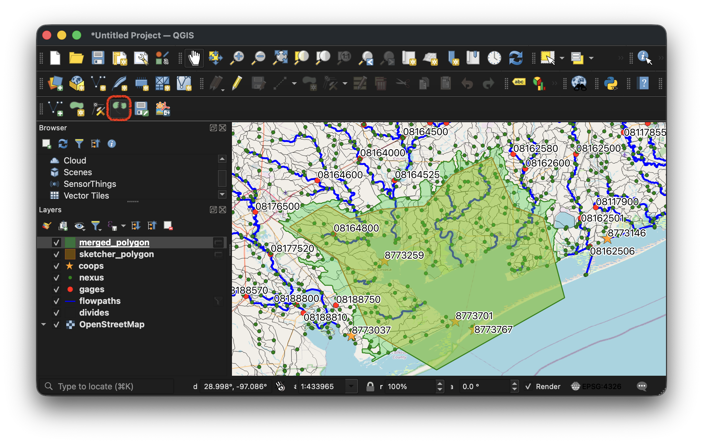
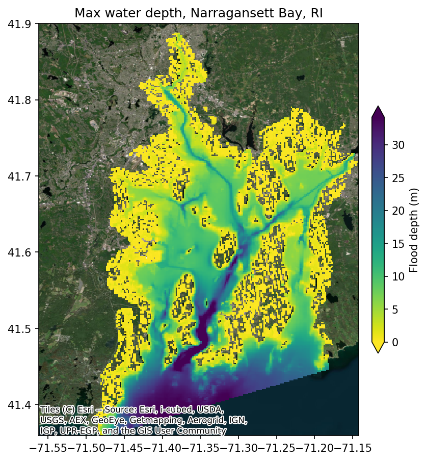

# NWM Coastal: Automated Coastal Model Calibration

## Why This Tool?

Running coastal models for calibration and forecasting involves many moving parts:
downloading and preparing meteorological, ocean boundary, river discharge data, and
configuring the model, running on HPC, and validating against observations. Previously,
this required 20+ bash scripts with dozens of environment variables, fragile date
arithmetic, and manual data management.

`coastal-calibration` replaces that workflow with a single Python package. One
configuration file drives the entire pipeline, from data download through model
execution to validation against NOAA tide gauges.

## What It Does

- **Domain definition**: QGIS plugin for interactively drawing the model domain and
    selecting NWM river discharge points
- **Model creation** (SFINCS): automated quadtree mesh generation from an AOI polygon
- **Data management**: download of NWM forcing (retrospective 1979-2023 or real-time
    analysis), STOFS ocean boundary conditions, and TPXO tidal data with date-range
    validation
- **Forcing preparation**: atmospheric regridding via ESMF, boundary condition
    processing with STOFS/TPXO fallback
- **Model execution**: SFINCS (single-node OpenMP) and SCHISM (multi-node MPI) with
    resumable stage-based pipelines
- **Validation**: automatic NOAA CO-OPS station discovery, water level comparison plots,
    and flood depth mapping

<p align="center">
  
  <br>
  <em>QGIS plugin: defining the model domain aligned to watershed boundaries</em>
</p>

<p align="center">
  
  <br>
  <em>Flood depth map from a SFINCS simulation of Narragansett Bay, RI</em>
</p>

## Supported Models

|                     | SFINCS                     | SCHISM                     |
| ------------------- | -------------------------- | -------------------------- |
| **Grid**            | Quadtree (regular)         | Unstructured triangular    |
| **Compute**         | Single-node, OpenMP        | Multi-node, MPI            |
| **Model Creation**  | Automated                  | Prebuilt mesh required     |
| **Flood Depth Map** | Yes (downscaled to DEM)    | Not yet supported          |
| **Domains**         | CONUS, Hawaii, Puerto Rico | CONUS, Hawaii, Puerto Rico |

## Design

- **Single configuration**: one YAML file (or Python dictionary) defines the entire
    simulation, with validation, sensible defaults, and support for multi-run templates
- **Resumable pipeline**: each stage (download, forcing, run, plot, ...) can be
    restarted individually, so a failed run does not need to start from scratch
- **Portable**: both SFINCS and SCHISM are included as submodules and compiled from
    source during environment setup, with no containers required. The same workflow runs
    on a local workstation or an HPC cluster.
- **Unified API**: the same two Python calls (`CoastalCalibConfig` +
    `CoastalCalibRunner`) work for both models; only the model-specific settings differ
- **Built for large models**: although written in Python, the package orchestrates
    compiled libraries for the heavy lifting: ESMF for atmospheric regridding,
    GDAL/NetCDF/HDF5 for spatial I/O on large files, and lazy loading to avoid reading
    entire datasets into memory. Python handles the workflow logic while
    performance-critical operations run in compiled code.

## Use Cases

This package supports two primary use cases:

1. **Retrospective calibration**: run historical simulations against NWM retrospective
    data (1979-2023) to tune model parameters and validate performance at NOAA gage
    stations
1. **Operational forecasting**: integrate with the Next Generation Water Modeling
    Framework (NGEN) as a coastal model realization, where `coastal-calibration`
    handles the model setup, forcing, and execution while NGEN orchestrates
    catchment-level workflows

## Quick Start

### Installation

Prerequisites: [Git](https://git-scm.com/) and
[Pixi](https://pixi.prefix.dev/latest/installation/).
Pixi handles all other dependencies including Python and compiling
SFINCS and SCHISM from source.

```bash
git clone https://github.com/NGWPC/nwm-coastal
cd nwm-coastal
pixi install -e dev
```

All commands below should be run with `pixi r -e dev` to activate
the environment.

### CLI

Generate a configuration file, adjust it, then run:

```bash
# SCHISM (default)
pixi r -e dev coastal-calibration init config.yaml --domain hawaii

# SFINCS
pixi r -e dev coastal-calibration init config.yaml --domain atlgulf --model sfincs
```

Validate and run:

```bash
pixi r -e dev coastal-calibration validate config.yaml
pixi r -e dev coastal-calibration run config.yaml
```

The pipeline supports `--start-from` and `--stop-after` for partial workflows:

```bash
pixi r -e dev coastal-calibration run config.yaml --start-from schism_boundary
pixi r -e dev coastal-calibration run config.yaml --stop-after schism_sflux
```

### Python API

```python
from coastal_calibration import CoastalCalibConfig, CoastalCalibRunner

config = CoastalCalibConfig.from_yaml("config.yaml")
runner = CoastalCalibRunner(config)
result = runner.run()

if result.success:
    print(f"Completed in {result.duration_seconds:.1f}s")
```

### Creating a SFINCS Model

Build a new SFINCS quadtree model from an AOI polygon:

```bash
pixi r -e dev coastal-calibration create create_config.yaml
```

The AOI polygon and discharge points can be created interactively using the QGIS plugin.

## Supported Data Sources

| Source      | Date Range               | Description           |
| ----------- | ------------------------ | --------------------- |
| `nwm_retro` | 1979-02-01 to 2023-01-31 | NWM Retrospective 3.0 |
| `nwm_ana`   | 2018-09-17 to present    | NWM Analysis          |
| `stofs`     | 2020-12-30 to present    | STOFS water levels    |
| `tpxo`      | N/A (local installation) | TPXO tidal model      |

**Domains**: `atlgulf`, `pacific`, `hawaii`, `prvi`

## Workflow Stages

### SCHISM (11 stages)

`download` → `schism_forcing_prep` → `schism_forcing` → `schism_sflux` → `schism_params`
→ `schism_obs` → `schism_boundary` → `schism_prep` → `schism_run` → `schism_postprocess`
→ `schism_plot`

### SFINCS (14 stages)

`download` → `sfincs_symlinks` → `sfincs_data_catalog` → `sfincs_init` → `sfincs_timing`
→ `sfincs_forcing` → `sfincs_discharge` → `sfincs_precip` → `sfincs_wind` →
`sfincs_pressure` → `sfincs_write` → `sfincs_run` → `sfincs_floodmap` → `sfincs_plot`

### SFINCS Creation (9 stages)

`create_grid` → `create_fetch_data` → `create_elevation` → `create_mask` →
`create_boundary` → `create_discharge` → `create_subgrid` → `create_obs` →
`create_write`

## Roadmap

- **SCHISM model creation**: integrate the existing SCHISM mesh subsetting capability
    into the package, providing an automated create workflow for SCHISM similar to what
    SFINCS already has. This will allow users to extract a regional subdomain from a
    larger SCHISM mesh using the same QGIS plugin and API.
- **Improved tidal boundary conditions**: replace the current 8-constituent TPXO
    implementation with a pure-Python module supporting all 32+ constituents and minor
    constituent inference, removing the dependency on an external Fortran binary
- **Multi-cycle STOFS stitching**: download and stitch multiple STOFS forecast cycles to
    cover simulations of any duration, eliminating the current 180-hour single-cycle
    limit
- **Regional STOFS subsetting**: spatially subset the global STOFS output to the model
    domain before download, reducing data transfer from ~12 GB per cycle to a few
    hundred MB
- **PyPI and conda-forge**: publish the package on PyPI and conda-forge so users can
    install with `pip install coastal-calibration` or
    `conda install coastal-calibration` without cloning the repository

## Credits

1. [NextGen Water Modeling Framework Prototype](https://github.com/NOAA-OWP/ngen)
1. [schism-dev](https://ccrm.vims.edu/schismweb/) community
1. [Deltares](https://www.deltares.nl/en/software-and-data/products/sfincs) community

## License

BSD-2-Clause. See [LICENSE](LICENSE.md) for details.
