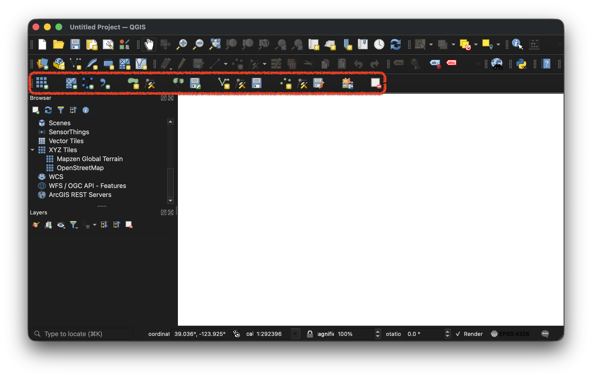
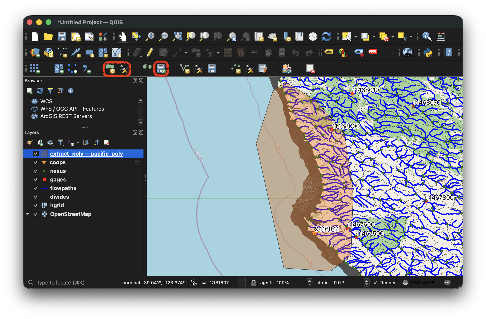

# Concepts and Workflows

NWM Coastal is a toolset for configuring, calibrating, and validating SCHISM and SFINCS
coastal models for the Next Generation National Water Model, driving each simulation
from a single configuration file and command-line interface. Routed NWM streamflow
enters at the models' river inflow points, tides and storm surge at the ocean boundary,
and meteorological data over the domain surface. From these inputs, the models simulate
total water level and coastal flooding. NOAA CO-OPS water level observations can be
downloaded automatically and compared against the simulated results.

Each NWM v3.0 coastal domain has an existing SCHISM mesh, and this package can subset
one to a smaller region of interest. Generating new SCHISM meshes programmatically is
not yet feasible for implementation into the package. SFINCS was included for the
complementary capability: HydroMT-SFINCS can build a complete model — grid, elevation,
roughness, and boundaries — programmatically from an area-of-interest polygon, making it
practical to stand up coverage or improve resolution wherever it may be needed.

This page describes the system as a whole: the directory structure it recommends, the
topobathy and land cover available for building models, the forcing data that drives
simulations, and the additional components required to run a forecast through the
NextGen framework.

For setting up, configuring, and calibrating the coastal models, 

For per-stage details, see [Workflow Stages](../user-guide/workflow-stages.md).

## Directory Layout

### ParallelWorks EA Cluster
NOTE: On ParallelWorks EA cluster, the parent directory for repos is called `ngencerf-app`
and the `nwm-coastal` repo is called `coastal-calibration`. This section is written
to be general, such that a user can set things up on their own machine (e.g. a Linux
machine or a Windows machine with WSL) or their own cluster. When working on the EA 
cluster, the environment variables would be: 
```
export NWM_COASTAL_ROOT=/ngencerf-app/coastal-calibration
export NWM_RTE_ROOT=/ngencerf-app/nwm-rte
```
It is recommended to set the 
With this setup, it is recommended to put `RUN_COASTAL_ROOT` in a users own directory,
for example /ngen-test/  
It is users choice where they would like `RUN_COASTAL_ROOT` to be, and the supporting
coastal data.

### General
`nwm-coastal` is typically cloned alongside the other NWM repositories in a common
parent directory, conventionally named `ngwpc/`. `nwm-rte`, the NextGen runtime
environment, is required for forecast runs and is cloned separately.

```
ngwpc/
├── nwm-coastal/      this repository — the coastal-calibration package and CLI
├── nwm-rte/          NextGen runtime environment; needed for forecasts only
├── run_ngen/         ESMF mesh/domain files; forcing engine and t-route outputs for forecasts
├── run_coastal/      coastal models and simulations
└── coastal_data/     TPXO tidal atlas, hydrofabric copies
```

[`scripts/setup_data_coastal.sh`](../getting-started/installation.md#download-model-data)
populates `run_ngen/`, `run_coastal/`, and `coastal_data/` with the data needed to run
the workflows. The remainder of `run_ngen/` is produced by running the forcing engine
and t-route from `nwm-rte`.

These directories can be placed anywhere, but data is passed between them as a workflow
runs, so their locations are set through four environment variables:

| Variable           | Points to                  |
| ------------------ | -------------------------- |
| `NWM_COASTAL_ROOT` | this repository's checkout |
| `NWM_RTE_ROOT`     | the `nwm-rte` checkout     |
| `RUN_NGEN_ROOT`    | `run_ngen/`                |
| `RUN_COASTAL_ROOT` | `run_coastal/`             |

The setup script honors `RUN_NGEN_ROOT` and `RUN_COASTAL_ROOT`, prompting for them
when they are unset. Forecast runs require these to be set, and optionally 
`TARGET_IMAGE_NAME`, the tag of the `nwm-rte` Docker image to run, which defaults to 
`ngen_rte_ghcr`.

`run_coastal/` is where the modeling actually happens:

| Directory | Contents |
| --------- | -------- |
| `schism_models/` | Prebuilt SCHISM base models, subset SCHISM base models you have created |
| `sfincs_models/` | Example SFINCS base models, SFINCS base models you have created |
| `schism_sims/` | SCHISM run configs and cycle simulations |
| `sfincs_sims/` | SFINCS run configs and cycle simulations |

You can set up your run configs to point at base models in other locations, and to run
simulations in other destinations too if you wanted - the configs are flexible. Because the 
forecasting examples included in this repo have automated components, this is the setup 
which that workflow expects.

`coastal_data/` is where supporting data is kept:

| Directory | Contents |
| --------- | -------- |
| `TPXO10_atlas_v2_nc/` | TPXO10 tidal constituents, used for harmonic boundary forcing |
| `hydrofabric_copies/ngen/` | NextGen hydrofabric gpkgs |
| `hydrofabric_copies/nwmv3/` | NWM v3 hydrofabric gdb |

Harmonic boundary forcing requires a local tidal atlas, any atlas compatible with pyTMD
can be set in the config. The setup script includes TPXO10.

The hydrofabrics are used by the QGIS plugin when selecting river discharge points, and
to crosswalk routed streamflow to the inflow points of the coastal models.

The setup script requires AWS credentials for the s3:ngwpc-dev bucket. If you do not have
credentials, see
[Without AWS credentials](../getting-started/installation.md#without-aws-credentials)
for where you can obtain some of this data publicly.

## SCHISM: Prebuilt Models

Prebuilt SCHISM models that the setup script downloads include:

| Model                 | Coverage                                           | Mesh size                      |
| --------------------- | -------------------------------------------------- | ------------------------------ |
| `atlgulf`             | Atlantic and Gulf coasts                           | 21.0 M elements / 10.5 M nodes |
| `pacific`             | US Pacific Coast                                   | 6.1 M / 3.1 M                  |
| `prvi`                | Puerto Rico and the US Virgin Islands              | 7.4 M / 3.7 M                  |
| `hawaii`              | Hawaiian Islands                                   | 1.7 M / 0.9 M                  |
| `alaska`              | South-central Alaska                               | 2.3 M / 1.2 M                  |
| `lake_erie`           | Lake Erie                                          | 1.9 M / 1.0 M                  |
| `lake_michigan-huron` | Lakes Michigan and Huron                           | 10.0 M / 5.0 M                 |
| `atlgulf_extract_03S` | Florida peninsula (VPU 03S), a subset of `atlgulf` | 2.7 M / 1.4 M                  |

The `atlgulf_extract_03S` model is an example of what the subsetting workflow produces from a full domain.

A run points at a base model with `model_config.prebuilt_dir`. The config also needs to know which
geogrid to map meteo forcing from:

```yaml
model_config:
  prebuilt_dir: ../schism_models/atlgulf
  geogrid_file: ../../run_ngen/data/esmf_mesh/NWM/domain/geo_em_CONUS.nc
```

The geogrid file describes the NWM meteorological forcing grid — its projection and cell
coordinates — and is what the forcing stages use to regrid LDASIN data onto the SCHISM
mesh. It is set explicitly with `model_config.geogrid_file`, so it must match the NWM
forcing domain your model sits in:

| Model                                                    | Geogrid file            |
| -------------------------------------------------------- | ----------------------- |
| `atlgulf`, `pacific`, `lake_erie`, `lake_michigan-huron` | `geo_em_CONUS.nc`       |
| `hawaii`                                                 | `geo_em_Hawaii.nc`      |
| `prvi`                                                   | `geo_em_Puerto_Rico.nc` |
| `alaska`                                                 | `geo_em_Alaska.nc`      |
| `atlgulf_extract_03S`                                    | `geo_em_vpu03s.nc`      |

These live in `run_ngen/data/esmf_mesh/NWM/domain/`, alongside a
`GEOGRID_LDASOUT_Spatial_Metadata_*.nc` companion for each. The Great Lakes models use
the CONUS grid, since NWM forcing for the lakes is part of the CONUS domain.

`geo_em_vpu03s.nc` is not an NWM domain file: it was cut out of the CONUS grid with
`forecast_demo/bin/extract_esmf_domain.py` so the forcing engine regrids over a
VPU-sized area instead of all of CONUS. A subset model can equally use its parent's full
geogrid — `atlgulf_extract_03S` works with `geo_em_CONUS.nc` — so extracting a smaller
one is a performance choice, not a requirement.

A model directory holds the model definition only — the mesh, a base parameter file, and
the other inputs that do not change between runs. Everything that does change, such as
streamflow, water level boundary, and meteorological forcing, belongs in the sims
directory and is generated per run by NWM Coastal from the run config, along with the
model output. Any parameter set in the base parameter file can be overridden in the run
config, which is useful when testing different parameter values.

### Running a NWMv3 SCHISM domain

To run one of the original NWMv3 domains you simply 
point `prebuilt_dir` at the full mesh instead of a subset. An example retrospective
configuration is at
[`schism_retro_full_domain.yaml`](../examples/schism_retro_full_domain.yaml).

Some of these domains are extremely large. The Atlantic/Gulf mesh is roughly 10.5 million nodes and 2.7
million elements, so it needs a genuine multi-node MPI allocation rather than a
workstation — see the [sbatch pattern](../user-guide/cli.md#using-run-inside-a-slurm-job-heredoc-recommended).
Subsetting exists so that regional simulations can be done, requiring less computational
resources.

You aren't locked into these SCHISM models - if you build a new SCHISM model, just add your model to the `schism_models\` directory and point to it in your run config to use it.

## QGIS Plugin: a tool for subsetting SCHISM models and/or creating SFINCS models

The [QGIS plugin](../user-guide/qgis-plugin.md) produces GeoJSON files that can be used for either subsetting an existing SCHISM mesh, or creating a new SFINCS model.



**Subsetting a SCHISM mesh.** Load a SCHISM mesh, draw a polygon around the region you
care about, and save it. `extract_mesh` then clips the mesh to that polygon and rebuilds
the boundaries where the polygon cuts across it, producing a new model directory.



**Defining a SFINCS domain.** The same drawing tools produce the AOI polygon that
`create` consumes, optional refinement polygon(s) for finer quadtree resolution, and the
NWM flowpaths that become river discharge points. Snapping the AOI to watershed
boundaries keeps the hydrology coherent.


## SFINCS Model Creation

There is no prebuilt SFINCS model library, but you can build a model for your area of interest with
a create configuration file:

```bash
pixi r -e dev coastal-calibration create create_config.yaml
```

`create` uses [HydroMT-SFINCS](https://deltares.github.io/hydromt_sfincs/) under the
hood. It builds a quadtree grid from the AOI, fetches and applies elevation data and land
cover (as roughness), masks active cells, sets boundary cells, adds river discharge points, builds
subgrid tables, and writes the model. The output directory of `create` becomes the `prebuilt_dir`
for simulation runs. See the [create stages](../user-guide/workflow-stages.md#sfincs-creation-stages)
for what each step does.

You aren't locked in to creating a SFINCS model through this workflow, using HydroMT-SFINCS directly
is also possible. Just add your model to the `sfincs_models\` directory and point to it in your run config
to use it.

## Topobathy and Land Cover

Several datasets are wired up for automatic download. Set `source` on an elevation
dataset and `create_fetch_data` retrieves it, clipped to your AOI.

| `source` | Dataset | Resolution | Best suited to | Retrieved from |
| -------- | ------- | ---------- | -------------- | -------------- |
| `nws_30m` | NWS topo-bathymetric DEM | 30 m | NWM coastal domains; requires `coastal_domain` | `s3://ngwpc-dev/nwm-tools-data/nws-topobathy/` (AWS credentials required) |
| `noaa_3m` | NOAA NCEI coastal topobathy | ~3 m | US coastal areas needing fine detail | [`noaa-nos-coastal-lidar-pds`](https://registry.opendata.aws/noaa-coastal-lidar/) (public) |
| `noaa_crm` | NOAA Coastal Relief Model | ~90 m | Broad US coastal coverage | [NCEI ArcGIS image service](https://gis.ngdc.noaa.gov/arcgis/rest/services/DEM_mosaics/CRM_mosaic/ImageServer) |
| `copdem_30m` | Copernicus DEM | 30 m | Global land elevation (default) | [`copernicus-dem-30m`](https://registry.opendata.aws/copernicus-dem/) (public) |
| `gebco_15arcs` | GEBCO 2025 | ~450 m | Global bathymetry (default) | [GEBCO via CEDA](https://www.gebco.net/data_and_products/gridded_bathymetry_data/) |
| `esa_worldcover` | ESA WorldCover 2020 | 10 m | Land cover, used for roughness | [`esa-worldcover`](https://registry.opendata.aws/esa-worldcover-vito/) (public) |

The defaults are `copdem_30m` for land and `gebco_15arcs` for bathymetry. Multiple
datasets can be combined; the order in which the datasets are listed in the config determines
the order in which they are applied. For example the first dataset is used, and then where
coverage is still missing the next is applied, and so on.

These are conveniences, not a closed list. If a fetch fails — an external service is
down, or credentials are unavailable — download the data yourself or choose a different
source, then apply it as described below. The data fetch happens once during setup, not 
during simulation.

### Using your own DEM

An elevation dataset with **no `source`** is looked up by `name` in a
[HydroMT data catalog](https://deltares.github.io/hydromt/)
listed under `data_catalog.data_libs`. This is how you use any DEM the auto-fetch
sources do not cover — including **Great Lakes bathymetry**, which none of the sources
above provide.

Write a catalog next to your GeoTIFF:

```yaml
# my_dem/data_catalog.yml
meta:
  version: v1.0.0
  name: my_dem
  hydromt_version: '>1.0a,<2'

my_dem:
  data_type: RasterDataset
  uri: my_dem.tif
  driver:
    name: rasterio
  metadata:
    category: topography
    crs: 4326
  data_adapter:
    rename:
      elevation: elevtn
```

Then reference it from the create configuration by name, with no `source`:

```yaml
elevation:
  datasets:
    - name: my_dem
      zmin: -20000

data_catalog:
  data_libs:
    - ./my_dem/data_catalog.yml
```

The `rename` entry matters: HydroMT-SFINCS expects the elevation variable to be called
`elevtn`. If your raster already uses that name, omit `data_adapter`.

For the full catalog format, including the other data types and driver options, see
Deltares' own documentation on
[preparing a data catalog](https://deltares.github.io/hydromt/latest/user_guide/data_catalog/data_prepare_cat.html)
and the
[data conventions](https://deltares.github.io/hydromt/latest/user_guide/data_catalog/data_conventions.html)
that define names like `elevtn`.

## Running Models

Both models use the same command and the same configuration schema; only
`model_config` differs:

```bash
pixi r -e dev coastal-calibration run <run_config_name>.yaml
```

Stages run in sequence and are resumable, so a failure part-way through can be picked up
with `--start-from` rather than restarted. `--dry-run` validates without executing.

Forcing comes from `simulation.meteo_source`: `nwm_retro` for historical periods and
`nwm_ana` for 2018 onward. Both are public and need no credentials. See
[Supported Data Sources](../user-guide/configuration.md#domains) for coverage by domain.

## Forecasts

Forecast runs need more than this repository. The coastal models consume two products
generated upstream by [`nwm-rte`](https://github.com/NGWPC/nwm-rte):

1. **Gridded meteorological forcing** from the NextGen forcing engine, passed as
   `paths.forecast_meteo_file`.
2. **River discharge** from a t-route regionalization run for the VPU, passed as
   `paths.troute_file`.

With those in hand the coastal configuration sets `meteo_source: ngen_forecast` and runs
exactly like any other simulation.

The [forecast demo](https://github.com/NGWPC/nwm-coastal/tree/development/forecast_demo)
gives more information on doing this, running example SCHISM and SFINCS simulations for 
AnA and short-range cycles. The forecast demo also showcases how to hotstart SCHISM and 
SFINCS models by setting the relevant keywords in the run configs.