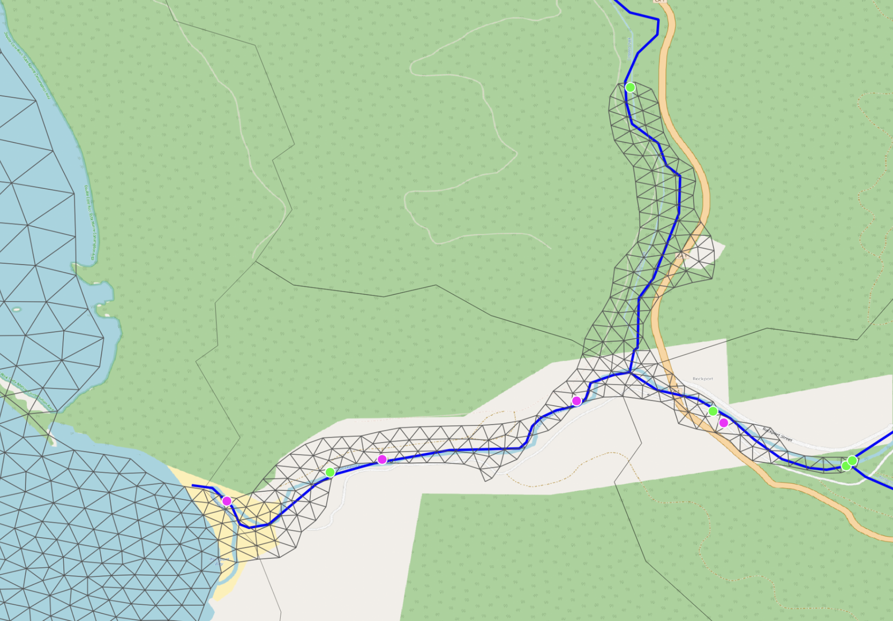

# Spurious source/sink points in the pre-built SCHISM meshes

## What the issue looks like

A small inland river segment from the Pacific pre-built SCHISM mesh:

Three NWM tributaries flow into this region: one entering the mesh from the top right,
and two on the right side that join inside the mesh at a Y-junction. Physically the
correct list of discharge sources for this region is **three** — one source at each
tributary's first entry into the mesh, and **no sinks** (the merged river leaves the
model through the open coastal boundary on the left, not as a sink).

What the pre-built mesh actually contains is roughly half a dozen alternating green
(source) and pink (sink) dots scattered along where the mesh boundary meanders across
each tributary. Every time a flowpath crosses the mesh edge it is flagged again — as a
source if the local flow direction enters the mesh, as a sink if it leaves — even though
the flowpath is the same physical river that already entered upstream.

## Root cause

This happens at SCHISM **mesh-generation time**, not at runtime. When the pre-built mesh
was built, the NWM flowpath geometries were not used as a constraint — only the
coastline / domain outline was. After the mesh existed, the source/sink list appears to
have been computed by a simple boundary intersection:

1. Intersect each NWM flowpath with the mesh outline.
1. At each intersection point, check the flowpath direction.
1. If the flowpath enters the mesh at that crossing → flag as a **source**.
1. If it exits → flag as a **sink**.

Because the mesh edge meanders across the river course, a single flowpath produces N
intersection points and ends up contributing N/2 spurious source/sink pairs that all
reference the same NWM feature ID. With three tributaries converging, you get the
several-dozen-dot pattern shown above.

At SCHISM runtime each of those points pulls the same NWM streamflow value, so the model
injects (and immediately drains) the streamflow multiple times along the same river
reach instead of once at the head of each tributary.

## What a robust replacement looks like

`SfincsDischargeStage._inflow_intersection_point`
([src/coastal_calibration/sfincs/create.py:848](https://github.com/NGWPC/nwm-coastal/blob/development/src/coastal_calibration/sfincs/create.py#L848))
solves the equivalent problem for SFINCS quadtree models. The same strategy generalizes
directly to SCHISM:

- For each NWM flowpath, compute its boundary intersections.
- If there is exactly one crossing, that is the discharge point.
- If there are multiple crossings, identify the upstream end of the flowpath by checking
    which endpoint sits *outside* the mesh (the other endpoint is downstream / inside),
    then pick the crossing closest to the upstream end. That is the only point that
    should receive the NWM streamflow.
- If the flowpath never crosses the boundary (entirely inside the mesh), fall back to
    the line endpoint closest to the boundary and snap to the nearest active grid cell.
- Drop sink points entirely. The merged river leaves the domain through the open coastal
    boundary, not as an interior sink; flagging every re-crossing as a sink is what
    produces the pink dots seen above.

The companion helpers `_collapse_to_points` and `_pick_upstream_crossing` in the same
file handle the shapely details (MultiPoint, GeometryCollection, etc.).

## Why we are not fixing it here

SCHISM **model creation is intentionally out of scope** for `coastal-calibration` — this
package operates on pre-built SCHISM models supplied by external collaborators. The
roadmap entry "SCHISM model creation" in the top-level
[README.md](https://github.com/NGWPC/nwm-coastal/blob/development/README.md)
captures this as future work. When that work happens, the discharge source/sink
generation step needs to use the upstream-crossing strategy above instead of flagging
every boundary crossing.

For the existing pre-built meshes, the duplication produces a small but real bias in the
inland streamflow injection — most coastal gauges are downstream and dominated by tidal
forcing, so the effect is hard to see in the validation plots, but for any retrospective
run that focuses on river-mouth dynamics it should be acknowledged.
