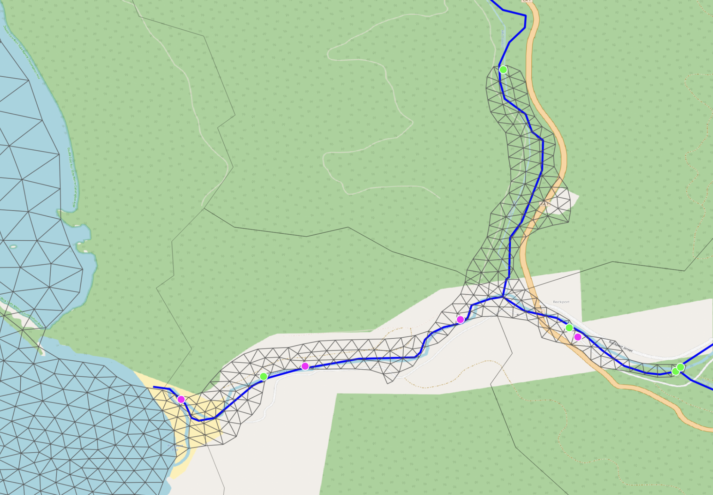

# Source and sink points in the SCHISM discharge crosswalk

A SCHISM river discharge crosswalk (`nwmReaches.csv` / `ngenReaches.csv`) routinely
contains several source and sink points along what is, on a map, a single river. This
note explains why that is correct for the meshes this package runs, how the crosswalk is
built, and what someone authoring a *new* SCHISM mesh should do differently.

Two audiences, two different answers:

- **Maintaining this package**: the behavior is intended and is covered by tests. Do not
    "fix" it.
- **Building a new SCHISM mesh from scratch**: you can avoid the pattern entirely, by
    placing the domain boundary differently. That is the real remedy.

______________________________________________________________________

## What the pattern looks like

A small inland river segment from the Pacific pre-built SCHISM mesh:



Three NWM tributaries flow into this region. Where the mesh edge meanders back and forth
across each tributary, the flowpath is flagged at every crossing — as a source where the
flow direction enters the mesh, as a sink where it leaves — so one physical river
contributes several alternating points rather than one.

## Why this is correct for these meshes

The NWMv3 SCHISM domain outlines follow the **~10 m topographic contour**, not a
watershed divide. A contour has no reason to respect river courses, so it wanders across
them: a flowpath genuinely leaves the model domain and genuinely re-enters it, sometimes
more than once.

Each of those crossings is therefore a real exchange of water across the model boundary,
not a duplicate of the one upstream. Water entering at the first crossing leaves the
domain again at the next, and must re-enter at the one after that. Collapsing them to a
single upstream point would inject the reach's flow once and never remove it, which is
not what the mesh geometry describes.

This is why the crosswalk keeps them all, and why
[`prepare-schism-reaches`](../user-guide/cli.md#prepare-schism-reaches) emits one row
per crossing. `tests/schism/test_reaches.py` pins this behavior — see
`test_transit_is_a_source_and_a_sink` (a reach entering, leaving and re-entering yields
two sources and one sink, all carrying the same reach id),
`test_a_stream_flowing_out_of_the_mesh_is_a_sink`, and `test_outlet_becomes_a_sink`.

## How the crosswalk is built

[`src/coastal_calibration/schism/reaches.py`](https://github.com/NGWPC/nwm-coastal/blob/development/src/coastal_calibration/schism/reaches.py):

- `_crossing_points` flattens the shapely intersection of a flowline with the mesh's
    land rings into a list of points.
- `_classify_crossings` decides direction per crossing. Flowlines are digitized upstream
    to downstream, so it tests whether the midpoint of the segment *before* the crossing
    lies inside the domain polygon: inside means the flow was already in the mesh and is
    now leaving (a **sink**); outside means it is entering (a **source**).
- `_one_row_per_element` collapses crossings that land in the same mesh element, keeping
    the one on the longest flowline. Note that it dedupes **per element within a
    block**, not per reach — so a single reach legitimately keeps several rows, at
    different elements.

The written file is a count-prefixed two-block text file (`write_reaches_blocks` in
`ngen_reaches.py`): the source block, a blank line, then the sink block, each row being
`element_id reach_id`. Nothing in the file carries a sign; a row is a sink because of
which block it sits in.

## How SCHISM consumes it

`make_discharge` in
[`schism/prep.py`](https://github.com/NGWPC/nwm-coastal/blob/development/src/coastal_calibration/schism/prep.py)
reads the crosswalk and writes `vsource.th`, `vsink.th` and `source_sink.in`. **The sign
is applied here**, not in the crosswalk:

```python
vsink[row_idx, i] = -1.0 * df[sid].to_numpy()
```

`merge_source_sink` then folds river discharge together with precipitation-derived
forcing into `source.nc`, which SCHISM reads when `if_source = -1`. A mesh with no
crosswalk gets `if_source = 0`, disabling river inflow entirely.

SCHISM reads `vsource` / `vsink` positionally by row index, not by any stored time value
— see the comment in `make_discharge`.

______________________________________________________________________

## If you are authoring a new SCHISM mesh

This is where the pattern can actually be removed. **Place the domain boundary so that a
flowpath crosses it once.** Snapping the outline to watershed divides where it crosses
river courses — rather than following a bathymetric contour across them — leaves each
tributary with a single inflow point and no interior sinks, which is both easier to
reason about and cheaper to force.

Two things this does *not* mean:

- **It is not a change to make in `reaches.py`.** An earlier version of this note
    recommended porting the SFINCS-side upstream-crossing strategy
    (`SfincsDischargeStage._inflow_intersection_point`, which picks the single crossing
    nearest the upstream end of a flowline) to SCHISM. Applied to the meshes we actually
    run, that would be a regression: it would discard real boundary exchanges and inject
    each reach's flow once without ever removing it.
- **Subsetting cannot fix it.** `extract_mesh` clips an existing mesh and rebuilds
    boundaries where the clip polygon cuts across it, so a subset inherits its parent's
    boundary placement everywhere else. Cook Inlet cut from the Alaska mesh has the same
    contour-following outline the parent does.

## Why this package does not address it

SCHISM **mesh generation from scratch** remains out of scope for `coastal-calibration`.
The package subsets existing meshes (`extract_mesh`, `split_mesh`) and can generate the
files a hand-assembled mesh is missing (`prepare-schism-mesh`, `prepare-schism-manning`,
`prepare-schism-reaches`), but it does not build a domain outline, and the outline is
what determines this. The "SCHISM model creation" roadmap entry in the top-level
[README.md](https://github.com/NGWPC/nwm-coastal/blob/development/README.md) tracks that
work; boundary placement is a requirement for it.

______________________________________________________________________

## The SFINCS comparison, and a genuine gap

SFINCS models in this package show only sources. That is a **domain convention, not a
model capability difference** — SFINCS supports sinks.

The difference is how the domain is drawn. A SFINCS AOI is unioned with NHF watershed
divides before the model is built (see
[Union with NHF Divides](../user-guide/qgis-plugin.md) and
[Concepts](../concepts/index.md)), so rivers cross the boundary once and only inflows
are expected. SCHISM's contour-following meshes cannot rely on that.

What this package genuinely lacks is any way to *produce* a SFINCS sink:

- Nothing derives one. `CreateDischargeStage` treats every flowline as an inflow.
    `_inflow_intersection_point` carries an explicit `TODO` for the case where a line
    crosses the boundary repeatedly with both endpoints outside the AOI, and a flowpath
    whose crossing cannot be resolved is dropped with
    `no usable AOI-boundary crossing,   skipping`.
- A hand-specified point is honored as a **location**, but not as a sink. You can supply
    your own `.src` / GeoJSON discharge-points file and merge it with derived points,
    but `SfincsDischargeStage._assign_discharge_timeseries` then overwrites the series
    for every point from NWM or t-route streamflow, keyed on an integer point name.
    There is no sign handling anywhere in the SFINCS discharge path, so the point
    receives positive inflow if its name resolves to a `feature_id`, and stays at zero
    if it does not. Compare the SCHISM path, which negates explicitly in
    `make_discharge`.

This matters for the **Great Lakes**, where a domain may legitimately contain an outlet
— the Niagara draining Lake Erie, the St. Clair draining Lake Huron. Representing one
needs a way to mark a discharge point as a sink *and* carry a signed series through
`_assign_discharge_timeseries`; being able to place the point is not sufficient. That is
tracked as a roadmap item.
