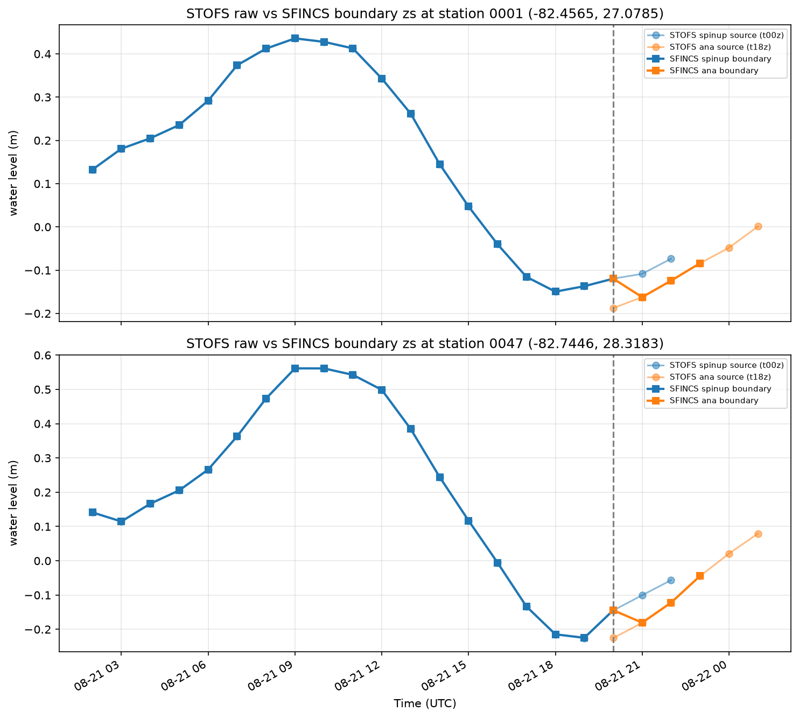

# STOFS boundary pipeline: status and remaining work

This note tracks the STOFS / tidal boundary pipeline. It was originally a four-phase
improvement plan written in May 2026; two of those phases have since been delivered, one
was solved by different means, and the remaining one turned out to be harder than
described. This revision records where each stands and what is actually left.

| Phase                                  | Status                                                                  |
| -------------------------------------- | ----------------------------------------------------------------------- |
| 1. STOFS-aware tidal fallback          | Premise was wrong; the real issue is folded into phase 2                |
| 2. Multi-cycle STOFS stitching         | **Open**, and blocked on cycle-to-cycle continuity — see below          |
| 3. Regional (spatial) STOFS subsetting | Objective met by time subsetting; spatial crop unimplemented, low value |
| 4. Pure-Python tidal prediction        | **Delivered** via pyTMD                                                 |

______________________________________________________________________

## Phase 4 — delivered

Tidal prediction is pure Python. `src/coastal_calibration/data/tides.py` wraps
[pyTMD](https://pytmd.readthedocs.io/) and exposes three entry points:

- `predict_tide_at_points` — elevations at arbitrary points over an arbitrary time
    array; the SFINCS forcing stage calls this directly so it can manage its own
    cadence.
- `write_schism_boundary` — writes the canonical 4-D `elev2D.th.nc` at a caller-supplied
    cadence.
- `extend_schism_boundary` — appends a tidal-only fill to an existing `elev2D.th.nc`.

This replaced the `predict_tide` Fortran binary, the bundled `pytides` library, the
`scipy.griddata` interpolation and the text-file subprocess pipeline in one step. The
following no longer exist: `tides/pytides/`, `tides/_ocean_tide.py`, `_otps.py`,
`make_otps_input`, `otps_to_open_bnds`, and the separate `k1.nc` … `s2.nc` constituent
files. pyTMD reads the TPXO10 atlas directly, and any netCDF model in
`pyTMD.io.load_database()` with an elevation group works — TPXO9, FES2014, GOT, EOT —
selected per run via `BoundaryConfig.tidal_model`.

This was solved by adopting a maintained library rather than by writing the bespoke
module the original plan specified. One consequence worth recording: that plan listed
three **suspected** bugs in the OTPS Fortran nodal-correction code (an L2 radian
conversion, an MS4 compound factor, a hardcoded M3 factor). Those were never confirmed —
the investigation was made moot rather than completed. They are noted here only so
nobody re-derives them believing there is an open action; there is not.

## Phase 3 — objective met, by time subsetting rather than spatial cropping

The original concern was that each STOFS cycle is ~12 GB globally while a simulation
needs a few hours of it. That is solved: `_download_stofs_time_subset` in
`data/downloader.py` opens the remote file lazily over HTTP range requests and
materializes only the `[start, end + 1h]` slice of `time` / `zeta`, plus the static mesh
variables (`x`, `y`, `element`) that `regrid_estofs.py` and the SFINCS reader need. The
full file is never downloaded.

Two related fixes landed alongside it:

- `resolve_stofs_cycle` walks back in 6-hour steps from the naive cycle until it finds
    one actually published, so a "now" start time doesn't name a cycle that does not
    exist yet.
- `_stofs_local_file_covers` verifies an existing local file's real time coverage before
    reusing it. `get_stofs_path` names files only by 6-hourly cycle, so a short-window
    run and a long-window run sharing a cycle resolve to the same path; a bare existence
    check let the narrower file satisfy the wider caller. This was confirmed live as the
    cause of a short-range run losing all real boundary forcing after its first hour.

Spatial cropping of the unstructured mesh is still unimplemented. With time subsetting
in place the remaining payoff is small, so this is retained as a low-priority idea
rather than a plan. If it is ever revisited: crop by selecting nodes inside the model
bounding box, keeping only triangles with all three vertices inside, and remapping the
connectivity to the new numbering. [Thalassa](https://github.com/ec-jrc/Thalassa)
implements this pattern, but it is EUPL-1.2 (copyleft) and unmaintained for two years,
so write an independent implementation rather than extracting its code.

______________________________________________________________________

## Phase 1 — the premise was wrong

The original note claimed the pipeline "unconditionally overwrites `elev2D.th.nc` from
hour 181 onward with tidal-only predictions", losing surge on retrospective runs where
STOFS covers the full window.

That is not what happens. `extend_schism_boundary` **appends**: it defaults to
`fill_from_hour=181`, reads the existing file's own `time_step` rather than assuming
hourly, and writes only rows from that point forward. Hours 0–180 of STOFS data are
never touched. The call site in `make_stofs_boundary` (`schism/prep.py`) also treats the
fill as best-effort — a failure logs loudly and leaves the first 180 h of valid forcing
in place rather than aborting — and warns when a >180 h run has no
`paths.tidal_atlas_dir` configured at all.

What remains true is narrower: hours 181+ are tidal-only **because only one STOFS cycle
is ever downloaded**, not because a check is missing. There is no surge data being
discarded; there is surge data that was never fetched. That makes this an aspect of
phase 2, not a separate task, and it is folded in below.

______________________________________________________________________

## Phase 2 — multi-cycle STOFS, and the continuity problem

Still open, and the interesting part is not the stitching.

### Current behavior

`_build_stofs_urls` constructs exactly one URL from the simulation start date's 6-hourly
cycle, and `download_data` resolves and fetches exactly one cycle per invocation. The
end date is not considered. Each STOFS cycle covers at most ~180 h, so a longer
simulation gets STOFS for its first 180 h and a pyTMD tidal fill after that.

### The forecast pipeline already spans multiple cycles

A single `coastal-calibration run` uses one cycle — but the forecast orchestration
invokes the CLI **once per segment**. `forecast_demo/bin/hotstart_coastal_models.sh`
runs a standalone `spinup` segment; `forecast_demo/ecf_home/run_stofs_download_ana.ecf`
and `run_stofs_download_sr.ecf` run the hourly `ana` and `sr` segments, each against its
own generated `run.yaml`. Every one of those independently calls `resolve_stofs_cycle`
for its own start time, and a spinup beginning ~21 h before the live cycle routinely
lands in a different 6-hourly bucket than the `ana` segment it hands off to.

Nothing joins those segments' **forcing**. Continuity across a segment boundary is
supplied only by the model hot-starting from the previous segment's dynamical state
(`paths.hot_start_file` for SCHISM, `rstfile` / `--sfincs-rst-file` for SFINCS); the
boundary series simply restarts from whatever cycle the new segment resolved.

### What that costs

At the handoff the t18z analysis cycle sits ~5–8 cm below the t00z spinup cycle at the
same valid time, at both stations. The SFINCS boundary inherits the step, and that step
enters the domain. We have seen this in forecast test cases.

So this is **a live forecast issue today**, not only a hazard for some future >180 h
stitching feature. Any work here has to address both.

### What a solution needs

The naive approach this note previously recommended — "for each output time step, select
the best available STOFS cycle, preferring the cycle whose forecast hour is closest to
the analysis time" — is precisely what produces the jump. Treat it as retracted. Picking
the most accurate value per timestep is not the same as picking a continuous series, and
the boundary condition needs the latter.

A workable design needs a continuity step before the stitched series is written.
Candidates, none yet chosen:

- **Offset matching.** Over the overlap between consecutive cycles, compute the mean
    difference per boundary node and shift the incoming cycle onto the outgoing one.
    Preserves shape, cheap, but accumulates drift across many seams.
- **Blending / tapering.** Weight the two cycles across their overlap window so the
    transition is continuous by construction. No discontinuity by design, at the cost of
    a physically mixed segment.
- **Rejection with a threshold.** Refuse a cycle whose overlap disagreement exceeds a
    configured tolerance and fall back to extending the previous one. Simple, and
    surfaces the problem instead of hiding it.

Whichever is chosen, it applies to the forecast segment handoff as much as to within-run
stitching, and the two existing additive-offset hooks are the natural places to look for
a seam: `correct_elevation` in `schism/prep.py` and the `forcing_to_mesh_offset_m` path
in `schism/boundary.py` / `sfincs/stages.py`. Both today apply a **static,
config-supplied** correction uniformly across one segment's series, so neither is a seam
correction as written — but both already do the "add an offset to a water-level series
before it is consumed" mechanics.

### Download-side changes still required

- `_build_stofs_urls` accepts a start *and* end, and generates one URL per 6-hourly
    cycle needed to cover the window.
- Only cycles not already cached are fetched; `_stofs_local_file_covers` extends to the
    multi-file case.
- `regrid_estofs` accepts multiple input files and produces one continuous
    `elev2D.th.nc`, with the continuity step above applied at each seam.

______________________________________________________________________

## Reference: STOFS data availability

| Property         | Value                                                             |
| ---------------- | ----------------------------------------------------------------- |
| Archive start    | 2020-12-30 (`estofs` naming) / 2023-01-08 (`stofs_2d_glo` naming) |
| Forecast horizon | ~180 hours per cycle                                              |
| Cycle frequency  | Every 6 hours (00, 06, 12, 18 UTC)                                |
| Archive location | `s3://noaa-gestofs-pds` (public, no auth)                         |
| File format      | Unstructured NetCDF (ADCIRC triangular mesh)                      |
| File size        | ~12 GB per cycle (global, full time range)                        |
| Subsetting API   | None; HTTP range reads are used instead                           |

For any retrospective simulation starting after 2020-12-30, overlapping cycles exist to
cover the entire period — the data is there, the pipeline just does not fetch more than
one cycle.
