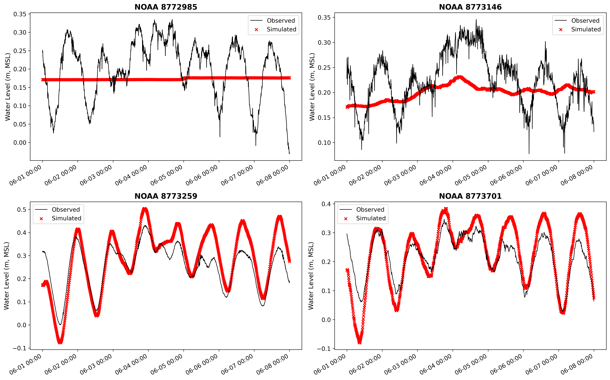
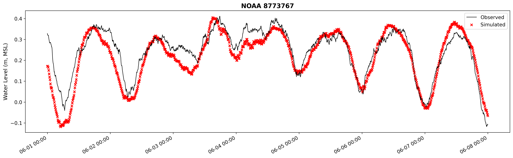

# Examples

These tutorial notebooks walk through the full Lavaca Bay (Texas) SFINCS workflow — from
building the model grid to running the simulation and comparing results against NOAA
tide-gauge observations.

Both notebooks cover the same two-phase workflow:

1. **Create** — build a SFINCS model from an Area of Interest polygon (grid, elevation,
    subgrid tables, boundary conditions, observation points).
1. **Run** — download forcing data, write SFINCS input files, execute the model, and
    plot simulated vs. observed water levels.

!!! note "Prerequisites"

    The examples require the downloaded forcing data cache (`docs/examples/downloads/`) and
    a compiled SFINCS executable (or Singularity image). See the
    [Quick Start](../getting-started/quickstart.md) for setup details.

- [{ loading=lazy }](notebooks/lavaca_cli.ipynb "CLI Tutorial")
    **CLI Tutorial**

- [{ loading=lazy }](notebooks/lavaca_api.ipynb "Python API Tutorial")
    **Python API Tutorial**

