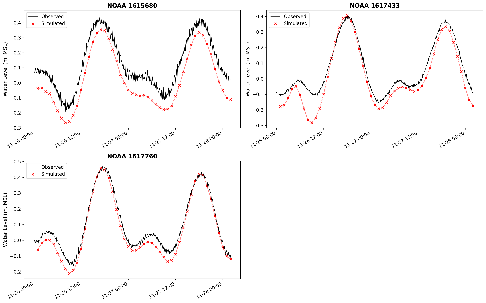

# Examples

These tutorial notebooks walk through coastal flood modeling workflows, from building
the model grid to running the simulation and comparing results against NOAA tide-gauge
observations.

The SFINCS notebooks cover a three-phase workflow:

1. **Create**: build a SFINCS model from an Area of Interest polygon (grid, elevation,
    subgrid tables, boundary conditions, observation points).
1. **Run**: download forcing data, write SFINCS input files, execute the model, and plot
    simulated vs. observed water levels.
1. **Flood Map**: downscale SFINCS water surface elevations onto a high-resolution DEM
    to produce a Cloud Optimized GeoTIFF of maximum flood depth.

The SCHISM notebook demonstrates the end-to-end workflow with native (container-free)
execution.

!!! note "Prerequisites"

    The SFINCS examples require the downloaded forcing data cache
    (`docs/examples/downloads/`) and a compiled SFINCS executable. See
    [Compiling SFINCS](../sfincs_compilation.md) for build instructions. The SCHISM example
    requires a compiled SCHISM binary; see [Compiling SCHISM](../schism_compilation.md).

- [{ loading=lazy }](notebooks/lavaca.ipynb "Lavaca Bay, TX")
    **Lavaca Bay, TX**

- [{ loading=lazy }](notebooks/narragansett.ipynb "Narragansett Bay, RI")
    **Narragansett Bay, RI**

- [{ loading=lazy }](notebooks/schism-hawaii.ipynb "Hawaii")
    **Hawaii (SCHISM)**

