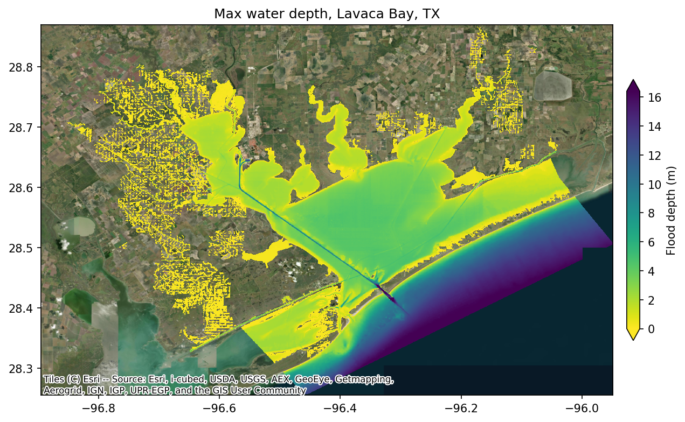

# Examples

These tutorial notebooks walk through the full SFINCS coastal flood modeling workflow —
from building the model grid to running the simulation and comparing results against
NOAA tide-gauge observations.

Each notebook covers the same three-phase workflow:

1. **Create** — build a SFINCS model from an Area of Interest polygon (grid, elevation,
    subgrid tables, boundary conditions, observation points).
1. **Run** — download forcing data, write SFINCS input files, execute the model, and
    plot simulated vs. observed water levels.
1. **Flood Map** — downscale SFINCS water surface elevations onto a high-resolution DEM
    to produce a Cloud Optimized GeoTIFF of maximum flood depth.

!!! note "Prerequisites"

    The examples require the downloaded forcing data cache (`docs/examples/downloads/`) and
    a compiled SFINCS executable. See [Compiling SFINCS](../sfincs_compilation.md) for build
    instructions.

- [{ loading=lazy }](notebooks/lavaca.ipynb "Lavaca Bay, TX")
    **Lavaca Bay, TX**

- [{ loading=lazy }](notebooks/narragansett.ipynb "Narragansett Bay, RI")
    **Narragansett Bay, RI**

