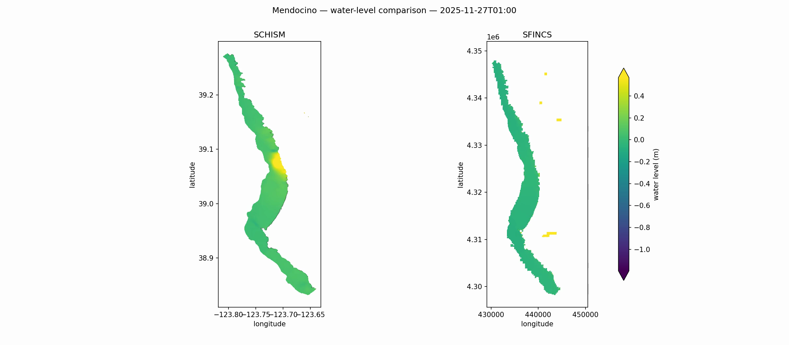

# Examples

Four notebooks cover the client-facing surface of the library:

- **Mendocino Walkthrough** is the headliner — extract a SCHISM subdomain from the
    Pacific mesh, drive it through the 12-stage SCHISM pipeline, derive the SFINCS AOI
    from the SCHISM mesh boundary using the `nwm_coastal` QGIS plugin, run SFINCS on the
    matching domain, then compare both models against a NOAA tide gauge and animate the
    two water-level fields side-by-side.
- **Lavaca Bay** is a SFINCS-only "build from an AOI" demo on a different domain. It
    covers the create + run flow with `SfincsCreator` and `CoastalCalibRunner`, then
    drives the post-processing plotting API directly (mesh inspection, flood depth map,
    water-surface/depth/anomaly snapshots, satellite basemap overlay, animation, and
    time series at user-specified observation points).
- **Lake Erie** is the Great Lakes counterpart to Lavaca: boundary forcing from NOAA's
    Lake Erie OFS (`leofs`, the FVCOM model behind GLOFS) instead of STOFS, and a DEM
    you download and register in your own HydroMT data catalog instead of one of the
    built-in auto-fetched sources, none of which carry Great Lakes bathymetry. It also
    documents the elevated-domain settings a lake 174 m above sea level needs.
- **Forecast Walkthrough** is the operational pipeline rather than a single model run —
    one spinup, one analysis-and-assimilation hour, and one short-range cycle, driving
    the nwm-rte forcing engine and t-route regionalization alongside SCHISM and SFINCS.
    Each expensive stage is its own cell so a failure can be retried in place.

!!! note "Prerequisites"

    The Mendocino, Lavaca and Lake Erie notebooks need a compiled SFINCS executable;
    Mendocino also needs SCHISM. Both binaries are built automatically when activating a
    pixi environment with the corresponding feature (`schism` or `sfincs`), so no manual
    build is needed in the standard workflow. See
    [Compiling SFINCS](../dev/sfincs_compilation.md) for build instructions when not using
    pixi.

!!! warning "Forecast Walkthrough is not self-contained"

    Unlike the other three, it drives external infrastructure: a built `nwm-rte` Docker
    image, `sudo docker` access, staged forcing data, and the four `NWM_COASTAL_ROOT` /
    `NWM_RTE_ROOT` / `RUN_NGEN_ROOT` / `RUN_COASTAL_ROOT` environment variables. Several
    cells may take a long time to run, so start Jupyter under `tmux`/`screen`. Setup is in
    [`forecast_demo/FORECAST_DEMO_README.md`](https://github.com/NGWPC/nwm-coastal/blob/development/forecast_demo/FORECAST_DEMO_README.md).

## Notebooks

- [{ loading=lazy }](notebooks/walkthrough.ipynb "Mendocino walkthrough — SCHISM + SFINCS comparison")
    **Mendocino Walkthrough (SCHISM + SFINCS)**

    End-to-end side-by-side demo on a single Pacific subdomain. Extract a sub-mesh from
    the full Pacific SCHISM domain with `extract_mesh`, run a SFINCS quadtree model on
    the same boundary (level-4 refinement along the SCHISM mesh edge,
    `mask.keep_largest_only`, tide-stable `run_param_overrides`), then compare the two
    against a shared NOAA gauge in a 3-line plot and render the water-level fields
    side-by-side with a shared colorbar via `animate_water_level_comparison`.

- [{ loading=lazy }](notebooks/lavaca.ipynb "Lavaca Bay, TX")
    **Lavaca Bay (SFINCS)**

    SFINCS-only build-from-AOI workflow: `SfincsCreator` produces a quadtree mesh with
    elevation, subgrid, and discharge sources from a single AOI polygon, then
    `CoastalCalibRunner` runs the simulation and validates against NOAA observations.
    Drives the post-processing plotting API directly to produce mesh and flood-map
    inspections, water-surface/depth/anomaly snapshots, a satellite-basemap overlay, an
    animation, and time series at three user-specified observation points.

- [**Lake Erie (SFINCS + LEOFS)**](notebooks/lake_erie.ipynb)

    Great Lakes build-from-AOI workflow on the Ohio shore of Lake Erie (Fairport Harbor).
    Walks through downloading a Great Lakes topobathy DEM, checking its CRS, NoData and
    vertical datum, and registering it in a HydroMT data catalog.
    Then runs SFINCS with `boundary.source: glofs` /
    `glofs_model: leofs` FVCOM forcing, validated against CO-OPS Fairport Harbor
    (9063053), on a mesh referenced to Lake Erie Low Water Datum, with the `zsini`
    and `latitude` settings an elevated domain needs.

- [**Forecast Walkthrough (hourly cycle)**](notebooks/forecast_walkthrough.ipynb)

    One hourly coastal forecast cycle run by hand, with no ecflow: SCHISM/SFINCS spinup
    and the t-route AnA-A bootstrap, then an analysis-and-assimilation hour (t-route
    AnA-A/AnA-B plus met forcing from the nwm-rte forcing engine), then a short-range
    cycle, with observed-vs-SCHISM-vs-SFINCS comparison plots after each. Paired with
    `forecast_demo/forecast_walkthrough.py`, which runs the same steps end to end.

