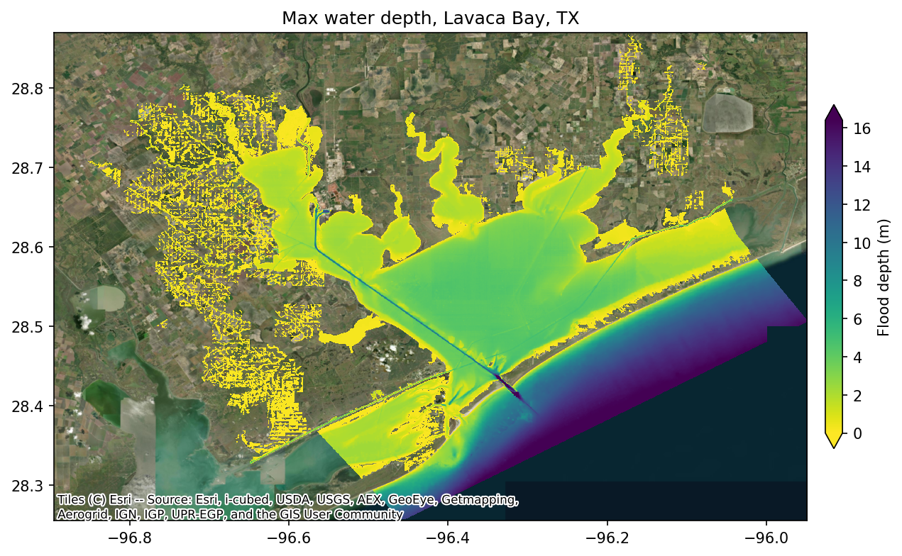
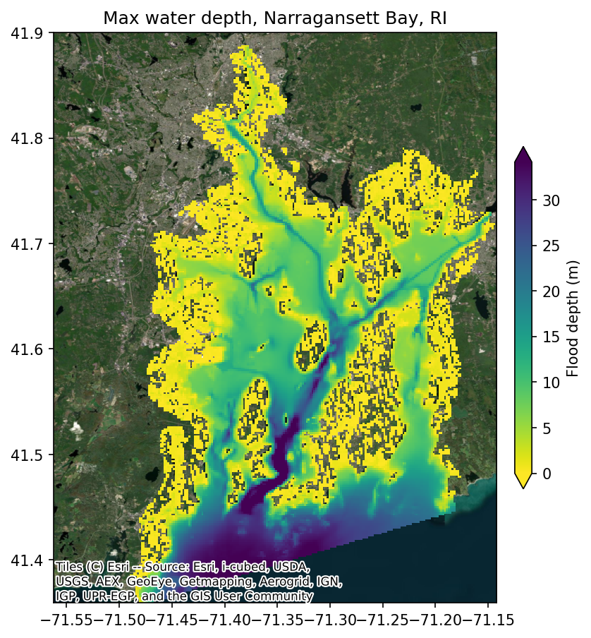
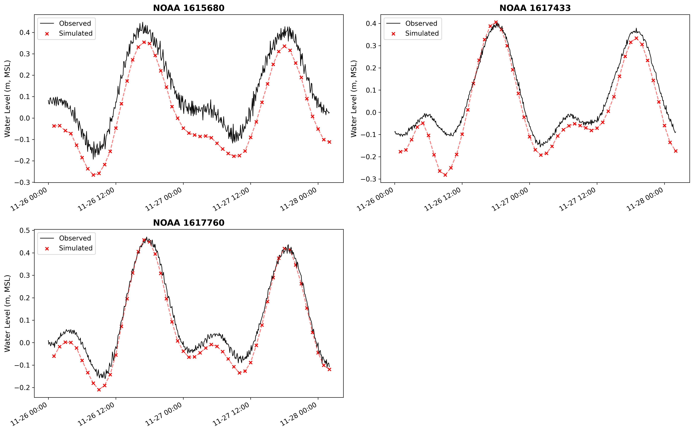
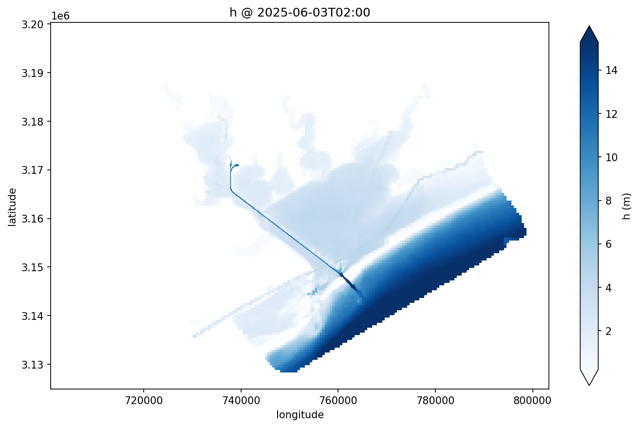
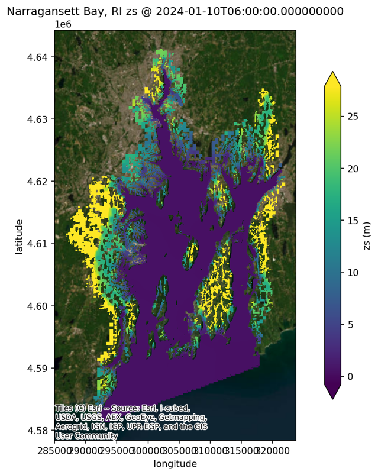
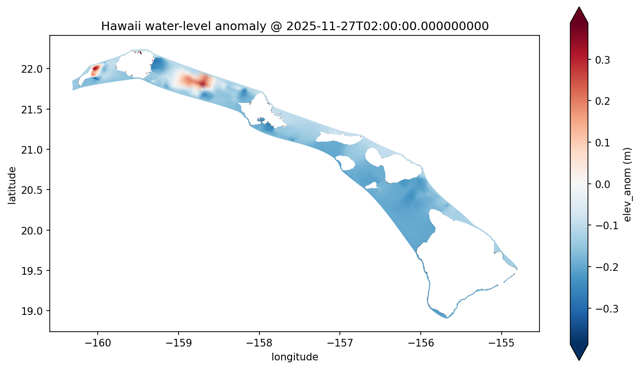

# Examples

Two sets of notebooks live here:

- **Tutorials** walk through coastal flood modeling workflows end-to-end, from building
    the model grid to running the simulation and comparing results against NOAA
    tide-gauge observations.
- **Post-run Plotting** demos assume an already-run model and exercise the
    post-processing plotting API (`plot_water_level`, `animate_water_level`,
    observation-point extraction) with verified numerical analyses.

The SFINCS tutorials cover a three-phase workflow:

1. **Create**: build a SFINCS model from an Area of Interest polygon (grid, elevation,
    subgrid tables, boundary conditions, observation points).
1. **Run**: download forcing data, write SFINCS input files, execute the model, and plot
    simulated vs. observed water levels.
1. **Flood Map**: downscale SFINCS water surface elevations onto a high-resolution DEM
    to produce a Cloud Optimized GeoTIFF of maximum flood depth.

The SCHISM tutorial demonstrates the end-to-end workflow with native (container-free)
execution.

!!! note "Prerequisites"

    The SFINCS tutorials require the downloaded forcing data cache
    (`docs/examples/downloads/`) and a compiled SFINCS executable. See
    [Compiling SFINCS](../sfincs_compilation.md) for build instructions. The SCHISM tutorial
    requires a compiled SCHISM binary; see [Compiling SCHISM](../schism_compilation.md). The
    **Post-run Plotting** demos only need the outputs of an already-completed model run and
    can be executed directly against any of the tutorial runs once they have finished.

## Tutorials

- [{ loading=lazy }](notebooks/lavaca.ipynb "Lavaca Bay, TX")
    **Lavaca Bay, TX**

- [{ loading=lazy }](notebooks/narragansett.ipynb "Narragansett Bay, RI")
    **Narragansett Bay, RI**

- [{ loading=lazy }](notebooks/schism-hawaii.ipynb "Hawaii")
    **Hawaii (SCHISM)**

## Post-run Plotting

Demonstrations of the post-processing plotting API on completed SFINCS and SCHISM runs.
Each notebook loads the 2-D water-level field, picks quantile-based colour limits from
wet cells, renders snapshots and a diverging water-level-anomaly view, produces an MP4
animation, and extracts water-level time series at user-specified observation points.

- [{ loading=lazy }](notebooks/plot_sfincs_lavaca.ipynb "Lavaca Bay post-run plotting demo")
    **Lavaca Bay (SFINCS)**

    Water-surface and depth snapshots, water-level anomaly with the head-to-shelf set-up
    gradient, and a three-point time series showing the 6-hour tidal phase delay up the
    bay.

- [{ loading=lazy }](notebooks/plot_sfincs_narragansett.ipynb "Narragansett Bay post-run plotting demo")
    **Narragansett Bay (SFINCS)**

    Snapshots with a satellite basemap, a water-level anomaly view, and a three-point time
    series that captures a storm-surge peak near +1.8 m on top of the tide.

- [{ loading=lazy }](notebooks/plot_schism_hawaii.ipynb "Hawaii post-run plotting demo")
    **Hawaii (SCHISM)**

    Unstructured-mesh snapshots with wet-cell masking from `dryFlagNode`, a water-level
    anomaly that shows the M2/S2 beat pattern across the archipelago, and three-point
    time series.

