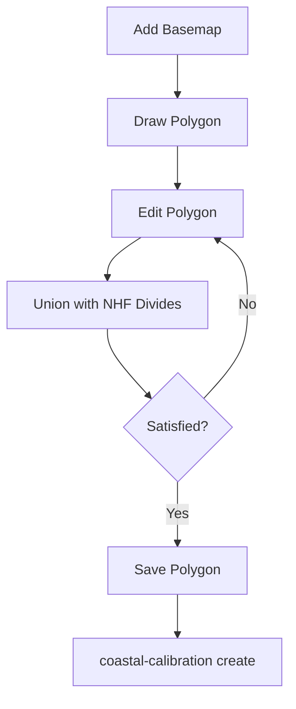

# QGIS Plugin

The NWM Coastal QGIS plugin provides an interactive graphical workflow for defining
coastal model domains. It loads National HydroFabric (NHF) data and NOAA CO-OPS station
layers as a basemap, lets you sketch and refine an area-of-interest (AOI) polygon, snap
the polygon boundary to NHF watershed divides, and export the result as GeoJSON for use
with the `create` command.

!!! note "Experimental"

    The QGIS plugin is experimental (v0.1.0) and requires QGIS 3.34 or later.

## Installation

The plugin lives in the `qgis_plugin/nwm_coastal/` directory of the repository. To
install it into QGIS:

1. Locate your QGIS plugin directory:

    - **Linux**: `~/.local/share/QGIS/QGIS3/profiles/default/python/plugins/`
    - **macOS**:
        `~/Library/Application Support/QGIS/QGIS3/profiles/default/python/plugins/`
    - **Windows**: `%APPDATA%\QGIS\QGIS3\profiles\default\python\plugins\`

1. Symlink or copy the plugin folder:

    ```bash
    ln -s /path/to/nwm-coastal/qgis_plugin/nwm_coastal \
        ~/.local/share/QGIS/QGIS3/profiles/default/python/plugins/nwm_coastal
    ```

1. Restart QGIS, then enable **NWM Coastal** in **Plugins > Manage and Install
    Plugins**.

After activation, an **NWM Coastal** toolbar appears with five buttons.

## Required Data

Before using the plugin, prepare two data files:

| File                 | Format               | Contents                                                                                                          |
| -------------------- | -------------------- | ----------------------------------------------------------------------------------------------------------------- |
| National HydroFabric | GeoPackage (`.gpkg`) | Must contain `flowpaths` and `divides` layers. `gages` and `nexus` layers are loaded if present but are optional. |
| CO-OPS Stations      | Parquet (`.parquet`) | NOAA CO-OPS tide-gauge station locations with a geometry column.                                                  |

## Toolbar Buttons

### 1. Add Basemap

Opens a dialog to select the NHF GeoPackage, CO-OPS parquet file, and a minimum stream
order filter. On confirmation the plugin loads:

| Layer         | Style                                          | Source                |
| ------------- | ---------------------------------------------- | --------------------- |
| OpenStreetMap | XYZ raster tiles                               | openstreetmap.org     |
| divides       | Transparent fill, black outline (0.1 width)    | GeoPackage            |
| flowpaths     | Blue lines (width 1), filtered by stream order | GeoPackage            |
| gages         | Red circles (size 3)                           | GeoPackage (optional) |
| nexus         | Green circles (size 2)                         | GeoPackage (optional) |
| coops         | Orange stars (size 7)                          | Parquet               |

The dialog validates that the GeoPackage exists and contains the required `flowpaths`
and `divides` layers before accepting.

### 2. Draw Polygon

Creates a temporary in-memory polygon layer (`sketcher_polygon`) and activates the **Add
Feature** tool so you can immediately sketch a polygon on the map canvas.

- Left-click to place vertices.
- Right-click to finish the polygon.
- The sketcher layer uses a semi-transparent orange fill so underlying basemap layers
    remain visible.

### 3. Edit Polygon

Activates the **Vertex Tool** on the sketcher layer, allowing you to move individual
vertices to refine the polygon shape.

### 4. Union with NHF Divides

Computes the geometric union of the sketcher polygon with all intersecting NHF divide
polygons. This snaps the AOI boundary to watershed boundaries, producing a
hydrologically meaningful domain.

- The original sketcher layer is preserved so you can edit and re-run the union.
- The union result appears in a separate `merged_polygon` layer with a semi-transparent
    green fill.
- Interior holes are removed and multipart results are collapsed to the largest polygon.
- CRS differences between the sketcher and divides layers are handled automatically.

### 5. Save Polygon

Exports the polygon to a GeoJSON file via a file-save dialog. If a merged layer exists
it is saved; otherwise the sketcher polygon is used.

The exported GeoJSON can be passed directly to the `create` command as the `aoi`
parameter:

```yaml
aoi: my_domain.geojson
output_dir: ./my_sfincs_model

grid:
  crs: EPSG:32617
```

```bash
coastal-calibration create create_config.yaml
```

## Typical Workflow



1. **Add Basemap** -- load NHF data and CO-OPS stations to orient yourself.
1. **Draw Polygon** -- sketch a rough AOI around the coastal area of interest.
1. **Edit Polygon** -- fine-tune vertices as needed.
1. **Union with NHF Divides** -- snap the boundary to NHF watershed divides.
1. Repeat steps 3--4 until the domain looks right.
1. **Save Polygon** -- export as GeoJSON.
1. Use the exported GeoJSON as input to `coastal-calibration create` to build a SFINCS
    model.
