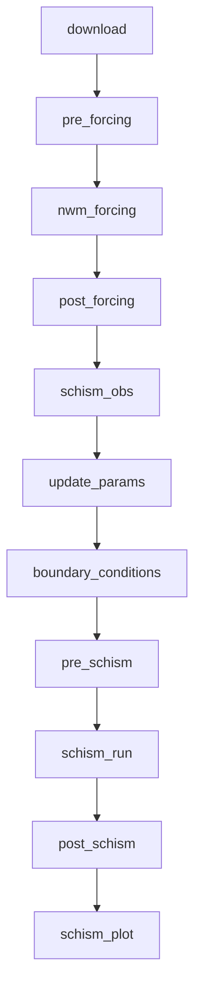
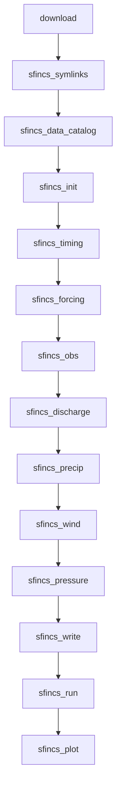
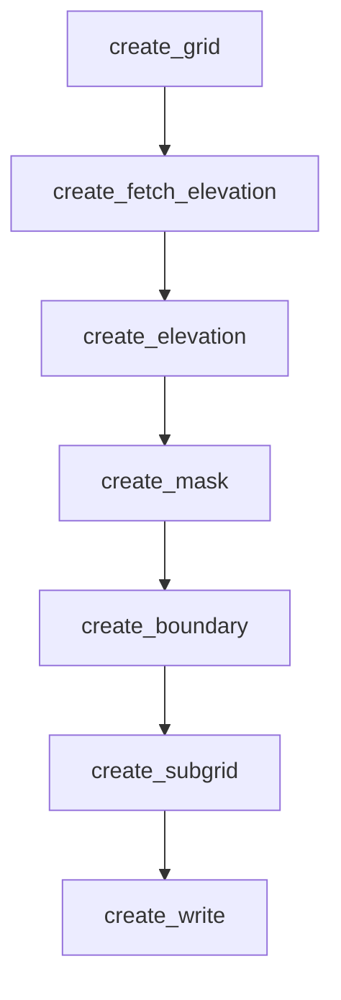

# Workflow Stages

The coastal calibration workflow consists of sequential stages, each performing a
specific task in the simulation pipeline. The stage order depends on the selected model
(SCHISM or SFINCS).

The `run` command executes all stages sequentially. Each stage is classified as either
**Python-only** or **container** (requires Singularity/MPI). All stages execute locally
on the allocated compute nodes (e.g., inside an `sbatch` script).

## SCHISM Stage Overview



## SFINCS Stage Overview



## SCHISM Stage Details

### 1. download

**Purpose:** Download required input data from remote sources.

**Data Sources:**

- NWM meteorological forcing (LDASIN files)
- NWM streamflow data (CHRTOUT files)
- STOFS or GLOFS water level data (when applicable)

**Runs On:** Compute node (Python-only, no container needed)

**Outputs:**

```
raw_download_dir/
├── meteo/nwm_ana/
│   └── *.LDASIN_DOMAIN1.nc
├── hydro/nwm/
│   └── *.CHRTOUT_DOMAIN1.nc
└── coastal/stofs/
    └── *.fields.cwl.nc
```

### 2. pre_forcing

**Purpose:** Prepare NWM forcing data for SCHISM.

**Tasks:**

- Copy and organize downloaded NWM files
- Set up directory structure for forcing generation
- Validate input data integrity

**Runs On:** Compute node (inside Singularity)

### 3. nwm_forcing

**Purpose:** Generate atmospheric forcing files using MPI.

**Tasks:**

- Regrid NWM data to SCHISM mesh
- Interpolate forcing variables
- Generate SCHISM-compatible forcing files

**Runs On:** Compute node (MPI parallel, inside Singularity)

**Outputs:**

```
work_dir/
└── sflux/
    ├── sflux_air_1.*.nc
    ├── sflux_prc_1.*.nc
    └── sflux_rad_1.*.nc
```

### 4. post_forcing

**Purpose:** Post-process forcing data.

**Tasks:**

- Validate generated forcing files
- Create forcing summary
- Clean up temporary files

**Runs On:** Compute node (inside Singularity)

### 5. schism_obs

**Purpose:** Automatically discover NOAA CO-OPS water level stations within the model
domain and generate a SCHISM `station.in` file so that SCHISM writes time-series output
at those locations.

**Enabled by:** `model_config.include_noaa_gages: true` (disabled by default)

**How it works:**

1. Parses `hgrid.gr3` to extract the coordinates of all open boundary nodes.
1. Computes a concave hull around the boundary points (using `shapely.concave_hull` with
    `ratio=0.05`).
1. Queries the NOAA CO-OPS API to find active water level stations that fall inside the
    hull polygon.
1. Writes `station.in` (SCHISM station definition file with elevation-only output flag)
    and a companion `station_noaa_ids.txt` that maps each station index to its NOAA
    station ID.

**Runs On:** Compute node (Python-only). Requires network access for the CO-OPS API
call.

**Outputs:**

```
work_dir/
├── station.in             # SCHISM station definition file
└── station_noaa_ids.txt   # Index-to-NOAA-ID mapping
```

!!! note "param.nml patching"

    When `station.in` exists, the `pre_schism` stage automatically patches `param.nml` to
    set `iout_sta = 1` (enable station output) and `nspool_sta = 18` (output interval in
    time-steps). The value `nspool_sta = 18` is chosen because it divides all `nhot_write`
    values used across domain templates (162, 324, 8640, etc.), satisfying the SCHISM
    constraint `mod(nhot_write, nspool_sta) == 0`.

### 6. update_params

**Purpose:** Generate SCHISM parameter file and symlink mesh files.

**Tasks:**

- Symlink `hgrid.gr3` and other mesh files into the work directory
- Create `param.nml` with simulation parameters
- Set time stepping configuration
- Configure output options

**Runs On:** Compute node (inside Singularity)

**Outputs:**

```
work_dir/
├── hgrid.gr3 (symlink)
└── param.nml
```

### 7. boundary_conditions

**Purpose:** Generate boundary conditions from TPXO or STOFS.

**Tasks (TPXO):**

- Extract tidal constituents at boundary nodes
- Generate harmonic boundary files
- Create `bctides.in` file

**Tasks (STOFS):**

- Interpolate STOFS water levels to boundary
- Generate time-varying boundary files
- Create `elev2D.th.nc` file

**Runs On:** Compute node (inside Singularity)

### 8. pre_schism

**Purpose:** Final preparation before SCHISM execution.

**Tasks:**

- Validate all input files present
- Set up symbolic links
- Configure MPI environment

**Runs On:** Compute node (inside Singularity)

### 9. schism_run

**Purpose:** Execute the SCHISM model.

**Tasks:**

- Run SCHISM with MPI
- Monitor progress
- Handle I/O scribes

**Runs On:** Compute node (MPI parallel, inside Singularity)

**Configuration:**

- Uses `nscribes` I/O processes from model config
- OpenMP threads configured via `omp_num_threads`
- Total processes = `nodes * ntasks_per_node`

### 10. post_schism

**Purpose:** Post-process SCHISM outputs.

**Tasks:**

- Combine output files
- Generate statistics
- Create visualization-ready files

**Runs On:** Compute node (inside Singularity)

### 11. schism_plot

**Purpose:** Compare SCHISM-simulated water levels against NOAA CO-OPS observations at
every station discovered by the `schism_obs` stage.

**Enabled by:** `model_config.include_noaa_gages: true`

**How it works:**

1. Reads the SCHISM station time-series from `outputs/staout_1`.
1. Loads the station-to-NOAA-ID mapping from `station_noaa_ids.txt`.
1. Fetches observed water levels from the CO-OPS API in the MLLW datum and converts to
    MSL using per-station datum offsets retrieved from the API.
1. Generates 2×2 comparison plots (four stations per figure) showing simulated vs
    observed water levels.
1. Saves PNG figures to the `figs/` subdirectory.

**Runs On:** Compute node (Python-only). Requires network access for the CO-OPS API
call.

**Outputs:**

```
work_dir/
└── figs/
    ├── stations_comparison_001.png
    ├── stations_comparison_002.png
    └── ...
```

!!! tip "Datum conversion"

    Observations are fetched in MLLW (Mean Lower Low Water) and converted to MSL (Mean Sea
    Level) so they share the same vertical reference as the SCHISM simulation output. The
    conversion offset is obtained from the CO-OPS datums endpoint for each station.

## SFINCS Stage Details

### 1. download

Same as SCHISM download stage. Downloads NWM meteorological forcing, streamflow, and
STOFS water level data.

### 2. sfincs_symlinks

**Purpose:** Create .nc symlinks for NWM data.

**Tasks:**

- Create symlinks in the working directory pointing to downloaded NWM files
- Organize files by type (meteo, hydro)

### 3. sfincs_data_catalog

**Purpose:** Generate a HydroMT data catalog.

**Tasks:**

- Build YAML data catalog for HydroMT-SFINCS
- Register NWM meteo, streamflow, and STOFS data sources

### 4. sfincs_init

**Purpose:** Initialise the SFINCS model from a pre-built template.

**Tasks:**

- Copy pre-built SFINCS model from `prebuilt_dir` into the work directory
- Remove stale netCDF output files from any previous run (prevents HDF5 segfaults when
    `write_netcdf_safely` encounters files with an incompatible schema)
- Set up model directory structure

### 5. sfincs_timing

**Purpose:** Set SFINCS model timing.

**Tasks:**

- Configure simulation start/end times
- Set output intervals

### 6. sfincs_forcing

**Purpose:** Add water level forcing.

**Tasks:**

- Read boundary point locations from `sfincs.bnd`
- For TPXO: synthesize tidal water levels from TPXO constituents using harmonic
    reconstruction
- For geodataset sources (STOFS): load the geodataset clipped around the boundary
    points, spatially interpolate to boundary locations using inverse-distance weighting
    (IDW), and inject into the HydroMT model
- Apply `forcing_to_mesh_offset_m` to anchor the forcing signal to the correct height on
    the mesh datum (see note below)
- Emit a warning if the adjusted water levels fall outside the ±15 m sanity range
- Write boundary forcing netCDF (`sfincs_netbndbzsbzifile.nc`) with a zero-filled `bzi`
    (infragravity) variable required by the SFINCS binary

!!! tip "Forcing vertical datum offset"

    Tidal-only sources like TPXO provide oscillations centred on zero (MSL) but carry no
    information about where MSL sits on the mesh's vertical datum. The
    `forcing_to_mesh_offset_m` parameter anchors the tidal signal to the correct geodetic
    height on the mesh. For sources already in the mesh datum (e.g. STOFS on a NAVD88 mesh),
    set this to `0.0`. The offset can be obtained from the
    [NOAA VDatum API](https://vdatum.noaa.gov/vdatumweb/api/convert).

### 7. sfincs_obs

**Purpose:** Add observation points.

**Tasks:**

- Add tide gauge locations from `observation_points`
- Configure observation output

### 8. sfincs_discharge

**Purpose:** Add discharge sources.

**Tasks:**

- Add NWM streamflow discharge points from `discharge_locations_file`
- Filter out source points that fall on inactive grid cells (prevents a SFINCS Fortran
    segfault caused by out-of-bounds array access)
- Generate discharge forcing time series

### 9. sfincs_precip

**Purpose:** Add precipitation forcing.

**Tasks:**

- Add NWM precipitation data as spatially distributed forcing
- Set the output resolution to `meteo_res` (or auto-derive from the quadtree grid)
- Clip the reprojected grid to the model domain to prevent CONUS-scale inflation

### 10. sfincs_wind

**Purpose:** Add wind forcing.

**Tasks:**

- Add NWM wind data as spatially distributed forcing
- Set the output resolution to `meteo_res` (or auto-derive from the quadtree grid)
- Clip the reprojected grid to the model domain to prevent CONUS-scale inflation

**Runs On:** Login node (Python-only)

### 11. sfincs_pressure

**Purpose:** Add atmospheric pressure forcing.

**Tasks:**

- Add NWM atmospheric pressure data as spatially distributed forcing
- Set the output resolution to `meteo_res` (or auto-derive from the quadtree grid)
- Clip the reprojected grid to the model domain to prevent CONUS-scale inflation
- Enable barometric pressure correction (`baro=1`)

**Runs On:** Login node (Python-only)

### 12. sfincs_write

**Purpose:** Write the final SFINCS model.

**Tasks:**

- Write all SFINCS input files (`sfincs.inp`, `sfincs.bnd`, etc.)
- Generate boundary and forcing NetCDF files

**Runs On:** Login node (Python-only)

### 13. sfincs_run

**Purpose:** Execute the SFINCS model.

**Tasks:**

- Run SFINCS inside Singularity container
- Uses single-node OpenMP parallelism (`omp_num_threads`)

**Runs On:** Compute node (OpenMP, inside Singularity)

### 14. sfincs_plot

**Purpose:** Compare simulated water levels against observations.

**Tasks:**

- Read SFINCS output at observation points
- Apply `vdatum_mesh_to_msl_m` to convert model output from the mesh datum to MSL
- Fetch NOAA CO-OPS observed water levels (MLLW converted to MSL using per-station datum
    offsets from the CO-OPS API)
- Generate comparison plots (simulated vs observed)
- Save figures to the `figs/` directory

**Runs On:** Login node or compute node (Python, requires network access)

!!! tip "Output datum conversion"

    SFINCS output inherits the vertical datum of the mesh (e.g. NAVD88). The
    `vdatum_mesh_to_msl_m` offset converts the simulated water levels to MSL so they can be
    compared with NOAA CO-OPS observations. This value can be obtained from the
    [NOAA VDatum API](https://vdatum.noaa.gov/vdatumweb/api/convert).

## Running Partial Workflows

The `run` command supports `--start-from` and `--stop-after`.

### CLI

```bash
# SCHISM examples
coastal-calibration run config.yaml --stop-after download
coastal-calibration run config.yaml --start-from pre_forcing --stop-after post_forcing
coastal-calibration run config.yaml --start-from boundary_conditions

# SFINCS examples
coastal-calibration run config.yaml --stop-after sfincs_write
coastal-calibration run config.yaml --start-from sfincs_run
```

### Python API

```python
from coastal_calibration import CoastalCalibConfig, CoastalCalibRunner

config = CoastalCalibConfig.from_yaml("config.yaml")
runner = CoastalCalibRunner(config)

# Run specific stages
result = runner.run(start_from="pre_forcing", stop_after="post_forcing")
```

## Error Handling

If a stage fails:

1. The workflow stops at the failed stage
1. Error details are logged
1. Subsequent stages are not executed
1. Exit code indicates failure

To resume after fixing an issue:

```bash
# Resume from the failed stage
coastal-calibration run config.yaml --start-from <failed_stage>
```

## Stage Timing

When `enable_timing` is true in the monitoring configuration, stage durations are
tracked and reported:

```console
Stage timing:
  download: 45.2s
  pre_forcing: 12.3s
  nwm_forcing: 234.5s
  post_forcing: 8.7s
  schism_obs: 3.8s
  update_params: 2.1s
  boundary_conditions: 156.8s
  pre_schism: 5.4s
  schism_run: 1823.6s
  post_schism: 67.2s
  schism_plot: 15.4s
Total: 2375.0s
```

## SFINCS Creation Stages

The `create` command builds a new SFINCS quadtree model from an AOI polygon. It uses a
separate configuration schema (`SfincsCreateConfig`) and a dedicated runner
(`SfincsCreator`) with resumable execution — completion is tracked in
`.create_status.json` so that interrupted runs can be resumed with `--start-from`.



### 1. create_grid

**Purpose:** Generate a SFINCS quadtree grid from the AOI polygon.

**Tasks:**

- Read the AOI polygon (GeoJSON, Shapefile, etc.)
- Create the base grid in the specified CRS
- Apply quadtree refinement based on configured levels and criteria

### 2. create_fetch_elevation

**Purpose:** Fetch a NOAA coastal DEM covering the AOI.

**Tasks:**

- Query the packaged NOAA DEM spatial index to find the best-matching dataset based on
    AOI overlap, resolution, and year
- Download the DEM tiles from the NOAA `noaa-nos-coastal-lidar-pds` S3 bucket
- Mosaic tiles and clip to the AOI extent

### 3. create_elevation

**Purpose:** Add elevation and bathymetry data to the grid.

**Tasks:**

- Load configured elevation datasets (e.g., fetched NOAA DEM, NWS topobathy)
- Interpolate elevation values onto the quadtree grid cells
- Apply `zmin`/`zmax` filters per dataset

### 4. create_mask

**Purpose:** Create the active cell mask.

**Tasks:**

- Determine which grid cells are active based on elevation thresholds
- Apply land/water masking criteria

### 5. create_boundary

**Purpose:** Create water level boundary cells.

**Tasks:**

- Identify grid cells along the open ocean boundary
- Assign boundary condition flags

### 6. create_subgrid

**Purpose:** Generate subgrid lookup tables.

**Tasks:**

- Compute high-resolution subgrid tables from the DEM
- These tables allow SFINCS to use coarse computational cells while capturing fine-scale
    topographic detail

### 7. create_write

**Purpose:** Write the complete SFINCS model to disk.

**Tasks:**

- Write all SFINCS input files to the configured `output_dir`
- The output directory can be used as `prebuilt_dir` in a simulation config
